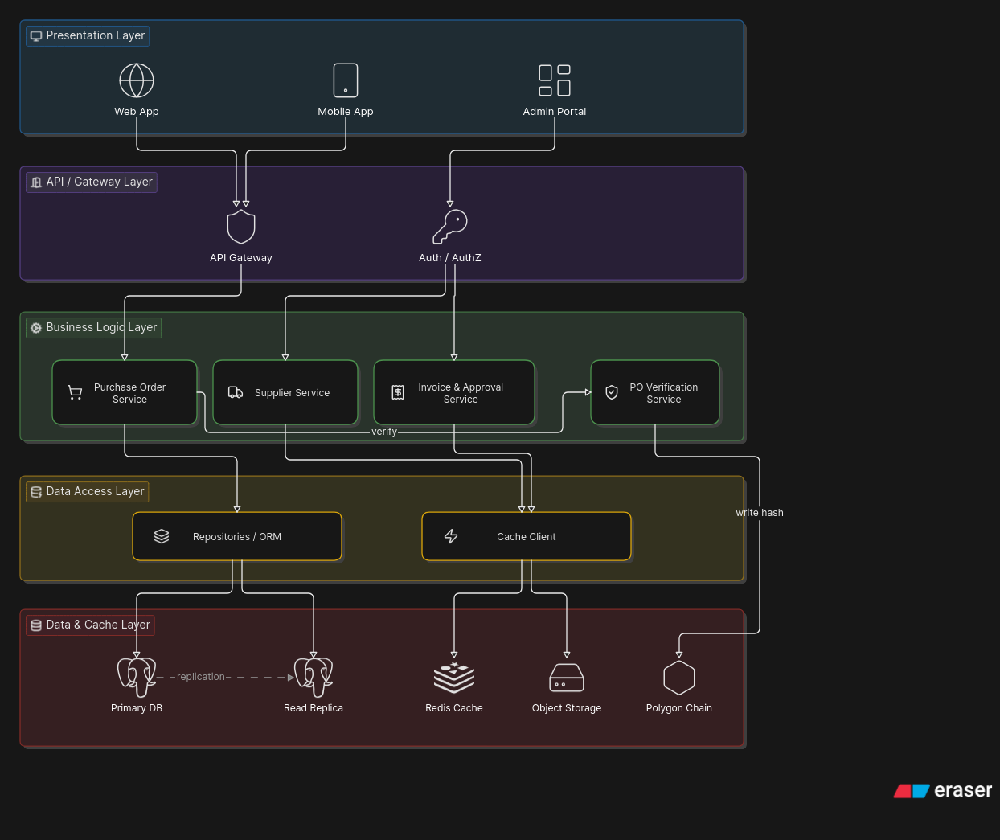
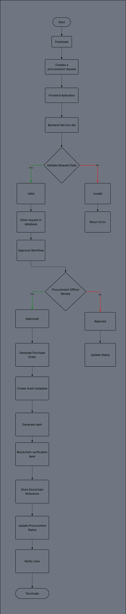
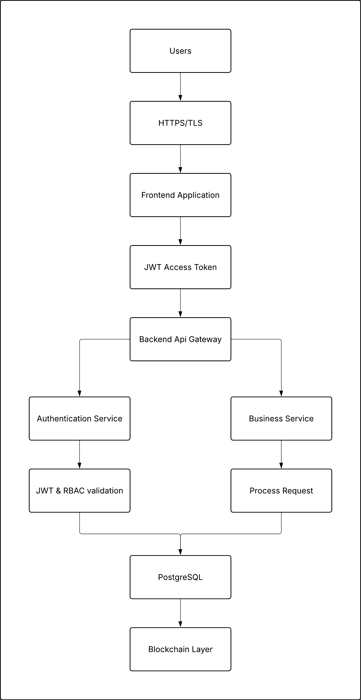

# High-Level Design (HLD)

---

# 1. Introduction

## Purpose

This documentation provides the high-level architecture of the procurement approval system. It defines the system's major components, interactions, deployment architecture, and design decisions that guide the implementation of the project.
---

# 2. System Overview

The procurement approval system is a web-based application that helps MSMEs manage the flow of expenses, audit those expenses, and streamline purchase orders.

The system will be used by procurement officers, approving managers, chief procurement officers, and owners.

Its core business includes capturing purchasing needs, validating against policies and budgets, routing requests to the correct approvers, controlling and documenting spending decisions, converting approvals into purchases, verifying delivery and payment accuracy, and providing visibility and auditability.

---

# 3. Architectural Goals

## Scalability

The system should support an increasing number of users, procurement requests, and transactions without significant performance degradation. The architecture allows future horizontal and vertical scaling.

## Maintainability

The system is organized into modular components with clear separation of responsibilities, making it easier to update, debug, and extend without affecting unrelated modules.

## Security

The architecture enforces secure authentication, role-based authorization, encrypted communication, and protected storage of sensitive procurement data to reduce the risk of unauthorized access.

## High Availability

The system is designed to remain accessible during normal operation through reliable deployment practices, database backup strategies, and fault-tolerant components where applicable.

## Auditability

All procurement activities are recorded to provide a complete audit trail. Blockchain is used as an immutable verification layer to ensure the integrity of critical approval records.

## Modularity

The application is divided into independent modules such as Authentication, Procurement, Approval Workflow, and Reporting, allowing individual components to evolve without requiring major changes to the entire system.

---

# 4. System Architecture

---

# 5. Architecture Style

## Modular Layered Architecture

The system follows a modular layered architecture. Instead of using one large monolithic code base, the system is divided into modules with specific responsibilities. The presentation layer handles user interaction through the web app. Requests pass through the API layer and authentication layer before reaching the business logic layer, which is divided into domain-specific services. The data access layer manages persistence and caching, while the data and infrastructure layer handles the primary database, read replica, cache storage, and blockchain network.

This architecture keeps the system organized and easier to maintain. It also allows each part of the system to be developed and updated independently. In addition, it gives the project a clear path for future migration to microservices if the system grows and needs to be distributed later.

---

# 6. Technology Stack

| Layer | Technology | Purpose |
|--------|------------|---------|
| Frontend | Vite | Frontend build tool and development environment |
| Backend | Express.js | Handles API requests and business logic |
| Database | Neon PostgreSQL | Stores application data |
| Blockchain | Polygon | Stores verification records for audit trails |
| Authentication | JWT & OAuth | Handles login and access control |
| Containerization | Docker | Packages the application for deployment |
| Hosting | Self-hosting / Oracle Cloud | Deploys and runs the system |

---

# 7. Major Components

The system is composed of several major components that are responsible for specific areas of functionality. Each component has a defined responsibility and communicates with other components through established interfaces.

---

# 7.1 Frontend Application

## Responsibilities

The frontend application provides the primary user interface for all system users.

Responsibilities include:

- Provides interfaces for procurement activities.
- Allows users to create, submit, review, approve, and monitor procurement requests.
- Provides dashboards based on user roles.
- Handles user input, form interactions, and client-side validation.
- Communicates with backend services for data retrieval and updates.
- Provides interfaces for audit verification and system administration.

## Key Interfaces

- Login and Authentication Interface
- Procurement Dashboard
- Approval Dashboard
- Vendor Portal
- Supplier Management Interface
- Expense Tracking Interface
- Audit Verification Interface
- Administration Interface

## Communicates With

- Backend Application Layer
- Authentication Service
- Notification Service

---

# 7.2 Backend Application Layer

## Responsibilities

The backend application acts as the core processing layer of the system. It manages business operations, coordinates system services, and enforces application rules.

Responsibilities include:

- Processing business requests.
- Managing procurement workflows.
- Validating user actions.
- Coordinating communication between system components.
- Managing vendor interactions.
- Generating procurement-related records.
- Integrating with database and blockchain services.

## Internal Services

The backend application is divided into modular services to maintain separation of responsibilities.

---

## Procurement Lifecycle Service

### Responsibilities

- Manages the complete procurement request lifecycle.
- Handles creation, modification, and tracking of procurement requests.
- Coordinates transitions between procurement states.
- Ensures procurement records follow defined workflows.

---

## Approval Workflow Service

### Responsibilities

- Manages procurement approval processes.
- Routes requests to appropriate approvers.
- Applies organizational approval rules.
- Maintains approval history and decision records.

---

## Vendor Management Service

### Responsibilities

- Maintains supplier information.
- Handles vendor invitations and communication.
- Manages supplier quotations and vendor responses.
- Supports vendor comparison processes.

---

## Reporting and Analytics Service

### Responsibilities

- Generates procurement reports.
- Provides spending analysis.
- Displays procurement trends and summaries.
- Supports management decision-making.

---

# 7.3 Authentication and Authorization Service

## Responsibilities

The authentication service manages user identity, access control, and secure communication between users and system resources.

Responsibilities include:

- User authentication.
- Session management.
- Token generation and validation.
- Role-Based Access Control (RBAC).
- User permission management.

## Supported Roles

- Administrator
- Procurement Officer
- Approving Manager
- Chief Procurement Officer
- Auditor
- Vendor

---

# 7.4 Data Management Layer

## Responsibilities

The data management layer handles the storage, retrieval, and organization of system information.

Responsibilities include:

- Persisting application data.
- Managing transactional records.
- Supporting reporting queries.
- Maintaining relationships between business entities.
- Providing reliable data access.

## Stored Data

The system stores:

- User accounts and roles.
- Procurement requests.
- Approval records.
- Vendor information.
- Quotations.
- Purchase orders.
- Invoice records.
- Audit metadata.
- Blockchain verification references.

## Storage Strategy

- PostgreSQL is used as the primary database for transactional data.
- Object storage is used for uploaded documents such as quotations, invoices, and receipts.
- Database records maintain references to stored documents.
- Sensitive information is protected through appropriate security controls.

---

# 7.5 Blockchain Verification Layer

## Responsibilities

The blockchain verification layer provides an immutable verification mechanism for finalized procurement records.

Responsibilities include:

- Creating cryptographic proofs of important procurement events.
- Storing record hashes on the blockchain.
- Providing verification mechanisms for auditors and authorized users.
- Ensuring tamper-evident audit capability.

## Stored Information

The blockchain stores:

- Cryptographic hashes of finalized records.
- Transaction identifiers.
- Verification timestamps.

Sensitive documents and operational data remain stored in traditional databases and object storage.

---

# 7.6 Document Management Service

## Responsibilities

The document management service manages procurement-related files and documents.

Responsibilities include:

- Storing uploaded documents.
- Managing document retrieval.
- Controlling document access permissions.
- Supporting secure handling of quotations, receipts, and invoices.

## Managed Documents

Examples:

- Vendor quotations.
- Purchase orders.
- Delivery receipts.
- Invoice documents.
- Procurement attachments.

---

# 7.7 Notification Service

## Responsibilities

The notification service manages communication between the system and users.

Responsibilities include:

- Sending procurement status notifications.
- Alerting users about pending approvals.
- Providing workflow updates.
- Sending email and in-app notifications.

## Notification Events

Examples:

- Procurement request submitted.
- Approval required.
- Request approved or rejected.
- Purchase order generated.
- Delivery status updated.
- Invoice verification completed.

# 8. Module Breakdown

The system is divided into modules so each part has its own responsibility.

- **Authentication** — Handles login, token validation, and secure access.
- **User Management** — Handles user signup, company registration, organization administration, and company-based roles and permissions.
- **Purchase Requisition** — Handles request creation, submission, and tracking.
- **Approval Workflow** — Handles request review, approval, rejection, and status updates.
- **Supplier Management** — Handles supplier records, supplier onboarding invitations, and quotations.
- **Purchase Order Management** — Handles the end-to-end process of creating, tracking, and approving purchase orders.
- **Delivery Verification** — Ensures the company is notified when a delivery has been received.
- **Invoice Verification** — checks whether uploaded invoice records match the related purchase order, vendor information, and supporting transaction data.
- **Reporting** — Shows dashboards, summaries, and procurement reports.
- **Application Audit Trail** — Records actions and connects transactions to blockchain verification.
- **Organization Administration** — Handles system settings, configurations, and organization administrative controls.
- **Supplier Dashboard** — Allows authenticated users belonging to invited supplier companies to complete supplier onboarding, access assigned RFQs, submit quotations, and view purchase orders associated with their company. Access to the supplier dashboard is granted only when the user is linked to a company with a valid supplier invitation or approved supplier relationship.

---

# 9. Data Flow

                    Employee
                       |
                       |
                       v
          Create Procurement Request
                       |
                       |
                       v
              Frontend Application
                       |
                       |
                       v
              Backend API Service
                       |
                       |
              Validate Request Data
                       |
                       |
              +--------+--------+
              |                 |
            Valid            Invalid
              |                 |
              v                 v
      Store Request        Return Error
       in Database             |
              |
              |
              v
      Approval Workflow
              |
              |
      Manager / Procurement
      Officer Review
              |
              |
       +------+------+
       |             |
    Approved       Rejected
       |             |
       v             v
 Generate PO      Update Status
       |
       |
       v
 Create Audit Metadata
       |
       |
       v
 Generate Hash
       |
       |
       v
 Blockchain Verification Layer
       |
       |
       v
 Store Blockchain Reference
       |
       |
       v
 Update Procurement Status
       |
       |
       v
 Notify Users

 

---

# 10. Security Architecture

## Security objectives

- Prevention of unauthorized access
- Safe guard sensitive data of clients 
- Maintain data integrity 

## Security architecture diagram

## Authentication

- JWT based authentication
- Role-Based Access Control (RBAC)
- Session management

## Authorization

- Least privilege access
- Role separation
- Resource ownership validation

## Data Protection

- HTTPS/TLS for all communication
- Encryption of sensitive data
- Secure password Hashing 

## Audit and Integrity

- System activity logging
- Blockchain verification of finalized procurement records
- Tamper evident audit trail

## Infrastructure Security

- Environment Variable management
- Database Backups
- Secure API endpoints
- Docker Container Isolation

---

# 11. Database Overview

The system uses a relational database to store the main operational records of the platform. 
The database supports multi-tenant data separation and manages users, vendors, procurement transactions, and supporting documents.

Major entities:

- **Tenants** — companies or MSMEs using the system.
- **Users** — system users under a tenant.
- **Vendors** — supplier records linked to a tenant.
- **Vendor Invitations** — invitation records for vendor access.
- **Purchase Orders** — main procurement transaction records.
- **Transaction Receipts** — receipt and proof records linked to purchase orders.

At a high level, a tenant can have many users, vendors, and purchase orders. A purchase order can also have multiple transaction receipts.

---

# 12. External Systems

- **Cloudflare R2 Storage** — Stores uploaded documents and procurement-related files.
- **Google OAuth** — Handles Google-based user authentication and login.
- **Cloudflare** — Provides DNS, security, and traffic routing for the application.
- **Oracle OCI** — Hosts the application and related infrastructure.
- **Neon PostgreSQL** — Stores the main relational data of the system.
- **Blockchain** — Stores verification hashes for audit trail and record integrity.

---

# 13. Deployment Architecture

Internet
   ↓
Cloudflare
   ↓
traefik proxy
   ↓
Oracle OCI
   ├── Frontend Application
   └── Backend API
          ├── Neon PostgreSQL
          ├── Cloudflare R2 Storage
          ├── Google OAuth
          └── Blockchain

---

# 14. Scalability Considerations

- **Horizontal scaling** — More backend instances can be added if traffic grows.
- **Vertical scaling** — Server resources such as CPU, RAM, and storage can be increased if needed.
- **Stateless backend** — The backend does not depend on local session memory, so any instance can handle a request.
- **Connection pooling** — The system reuses database connections instead of opening a new one every time.
- **Database indexing** — Important columns can be indexed to make searches and lookups faster.
- **Query optimization** — Queries should be written efficiently to avoid slow reads and unnecessary processing.
- **Caching strategy** — Frequently used data can be cached to reduce database load.
- **Load balancing** — Requests can be distributed across multiple instances.
- **Container orchestration** — Containers can be managed and scaled more easily across environments.
- **Future microservices migration** — The current modular design supports future migration to microservices if needed.

---

# 15. Reliability & Availability

- **Backup strategy** — The system stores regular backups of the database and important files so data can be restored if needed.
- **Disaster recovery** — If the main system fails, the application can be redeployed and restored from backups.
- **Fault tolerance** — RAID can be used on the storage layer to reduce downtime if a disk fails, while separate backups are still kept for recovery from data loss.
- **Monitoring** — UptimeRobot can be used to monitor the availability of the application and detect downtime.
- **Logging** — Application logs and blockchain transaction logs are used for debugging and auditing.
- **Health checks** — The backend exposes health endpoints so monitoring tools can verify that the system is running properly.
---

# 16. Risks and Constraints

| Risk | Mitigation |
|---|---|
| Blockchain downtime | Queue data and sync later. |
| Database failure | Restore from backup. |
| Internet outage | System will not be accessible. |
| Third-party service failure | Some features may stop temporarily. |
| Slow performance | Use indexing, caching, and query tuning. |

---

# 17. Assumptions

- Users have internet.
- Database is the main data store.
- Blockchain is for verification only.
- Files are stored outside the database.
- Third-party services will be available.