# Low Level Design

# Introduction  

## Purpose

This documentation serves as a technical implementation of the 
procurement management system

Low level Design primarily focus on internal design of each of the 
system's module including api's, Database interactions, Business logic, 
Validation rules, workflows and class relationships.

# Module Overview 

Modules Included

- Authentication
- User Management
- Procurement Request
- Approval Workflow
- Supplier Management
- Purchase Order Management
- Delivery Verification
- Invoice Verification
- Reporting
- Organization Administration
- Supplier Dashboard

## Module 1

Authentication

---

### Responsibilities

- Handle user signup and login using valid account credentials.
- Authenticate user credentials before granting access to the application.
- Generate, issue, validate, refresh, and revoke authentication tokens.
- Protect secured API endpoints using authenticated session or token-based access.
- Maintain authentication status and session security for registered users.
- Return the authenticated user context for the current session.

### Module Dependencies

- Depends On: `users`, `refresh_tokens`, `user_sessions`, and `audit_trails`.
- Produces: registered user accounts, authenticated sessions, authentication tokens, token validation results, and authenticated user context.

---

### Functional Requirements

- The system shall allow new users to sign up using valid registration details.
- The system shall allow registered users to log in using valid authentication credentials.
- The system shall validate submitted signup and login data before processing authentication.
- The system shall generate authentication tokens after successful login.
- The system shall allow the system to validate access tokens for protected API requests.
- The system shall allow the system to refresh authentication tokens using a valid refresh mechanism.
- The system shall allow authenticated users to log out and invalidate their active session or refresh token.
- The system shall deny access to protected resources when authentication tokens are missing, invalid, expired, or revoked.
- The system shall allow the system to return the authenticated user context after successful token validation.
- The system shall restrict secure application features to authenticated users only.

---

### Business Rules

- Signup shall create a valid user account before login is allowed.
- Only registered and active users shall be allowed to authenticate into the system.
- A user must provide valid login credentials before authentication tokens can be issued.
- Authentication tokens must be generated only after successful credential validation.
- Access to protected resources shall require a valid and non-expired access token.
- Refresh operations shall be allowed only when the provided refresh token or refresh session is valid and not revoked.
- Logging out shall invalidate the active refresh token or authenticated session according to the system’s token management rules.
- Invalid, expired, or revoked tokens shall not be accepted for secure access.
- Authentication failures shall not reveal sensitive credential or token details to the client.

---

### API Endpoints

POST  
/api/auth/signup  
/api/auth/login  
/api/auth/refresh  
/api/auth/logout  
/api/auth/validate-token

GET  
/api/auth/me

---

### Validation

- full_name
- email
- password
- access_token
- refresh_token
- user_status
- session_status
- Email must be in a valid format
- Password must not be empty
- Password must meet the configured security requirements
- Signup must be blocked when required registration fields are incomplete
- Login must be blocked for inactive or unauthorized users
- Access token must be valid before protected access is granted
- Refresh token must be valid and not revoked before a new access token is issued
- Logout request must reference a valid authenticated session or token context
- Token validation must fail for expired, invalid, or revoked tokens

---

### Database Tables

- **user_sessions**
  - Stores the active and historical authenticated sessions of users.
  - Includes user reference, session token reference, login timestamp, expiration timestamp, logout timestamp, session status, and client metadata.

- **refresh_tokens**
  - Stores refresh token records used for token renewal and session continuation.
  - Includes user reference, token value or token identifier, issued timestamp, expiration timestamp, revocation status, and revocation timestamp.

- **Referenced Existing Tables**
  - `users` — stores the registered user accounts allowed to sign up and authenticate into the application.
  - `audit_trails` — stores significant authentication-related events where applicable.

---

### Sequence Diagram

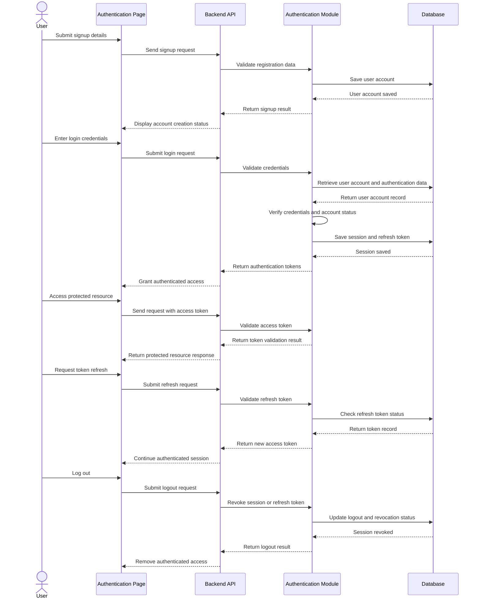

---

### Classes

#### authRouter

Defines the API routes for signup, login, logout, token refresh, token validation, and authenticated user retrieval. It maps incoming HTTP requests to the appropriate controller functions.

#### authController

Handles authentication API requests and responses. It receives requests for signup, login, logout, token refresh, token validation, and authenticated user context retrieval, then returns the appropriate response to the client.

#### authService

Contains the business logic for authentication operations. It validates signup and login credentials, creates user accounts, issues authentication tokens, verifies token status, refreshes access tokens, revokes sessions, and enforces secure access rules.

#### authRepository

Handles data access and database queries related to user authentication sessions, refresh tokens, and authentication state records.

#### authValidator

Validates request data for authentication operations. It ensures signup credentials, login credentials, token inputs, and session-related data are complete and correctly formatted before processing.

---

### Error Handling

400  
Invalid authentication request data

401  
Invalid credentials or unauthorized access

403  
User account is inactive or access is restricted

404  
Authenticated user or session record not found

409  
User account already exists or authentication session is already revoked or in conflicting state

422  
Authentication validation failed

500  
Internal server error

503  
Authentication service unavailable

---

## Module 2

User Management

---

### Responsibilities

- Handle company registration and company profile maintenance.
- Store and maintain company profile details and user membership under the registered company.
- Allow authorized users to view and update their own profile information.
- Allow authorized company administrators to manage company user accounts.
- Control access to procurement functions based on company-scoped roles and permissions.

### Module Dependencies

- Depends On: Authentication, `users`, `companies`, `roles`, `permissions`, `user_roles`, and `role_permissions`.
- Produces: company records, updated user profiles, company user account changes, role assignments, and permission mappings.

---

### Functional Requirements

- The system shall allow the initial organization administrator to register and maintain company details in the application.
- The system shall allow the system to associate a registered user with a company as its organization administrator after company registration.
- The system shall allow authorized users to view and update their account information within the scope allowed by the company.
- The system shall allow authorized company administrators to create, view, update, deactivate, and remove company user accounts after company setup is completed.
- The system shall allow authorized company administrators to assign roles and permissions to company users based on authorized access requirements.
- The system shall allow authorized company administrators to search and filter company users by name, email, role, or account status.
- The system shall allow the system to enforce access restrictions based on company membership, assigned roles, and permissions.
- The system shall restrict company user and role management functions to authorized organization administrators only.

---

### Business Rules

- A company record must be created before company-level administration can be fully performed.
- The registered user designated during company setup shall become the organization administrator of that company.
- Every managed user account must belong to one valid company record based on the current system design.
- A user account must have at least one valid company-scoped role before it can access protected procurement functions.
- Company administrators shall manage only users belonging to their own company.
- Inactive or deactivated user accounts shall not be allowed to access the system.
- Company-related roles and permissions shall apply only within the scope of the user’s registered company.
- Significant user, company, role, and membership changes shall be recorded with the acting user and timestamp.

---

### Internal Sections

#### User Profile Management

Handles self-service user profile retrieval and profile updates for the authenticated user.

**API Endpoints**

GET  
/api/users/profile

PUT  
/api/users/profile

**Validation**
- full_name
- email
- contact_number
- Email must be in a valid format
- User email must be unique within the allowed account rules
- Contact number must follow the accepted format when provided

#### Organization (Company) Management

Handles company registration and company profile maintenance for the SaaS platform.

**API Endpoints**

POST  
/api/companies/register

GET  
/api/companies/:companyId

PUT  
/api/companies/:companyId

**Validation**
- company_name
- company_email
- company_address
- company_contact_number
- company_status
- Company name must not be empty during company registration
- Company record must contain required organization details before setup is completed
- Company email must be in a valid format when provided
- Company status must match an allowed company state

#### User Administration

Handles company-scoped user creation, retrieval, update, deactivation, and removal after company setup is completed.

**API Endpoints**

POST  
/api/companies/:companyId/users

GET  
/api/companies/:companyId/users  
/api/companies/:companyId/users/:userId  
/api/companies/:companyId/users?status=active  
/api/companies/:companyId/users?role=:roleName

PUT  
/api/companies/:companyId/users/:userId  
/api/companies/:companyId/users/:userId/status

DELETE  
/api/companies/:companyId/users/:userId

**Validation**
- full_name
- email
- password
- user_status
- User email must be unique within the allowed account rules
- Password must meet the configured security requirements when applicable
- User status must match an allowed account state
- Company user administration must be restricted to the acting administrator’s company scope

#### Role & Permission Management

Handles company-scoped role assignment, role removal, and permission reference retrieval for RBAC enforcement.

**API Endpoints**

POST  
/api/companies/:companyId/users/:userId/assign-role  
/api/companies/:companyId/users/:userId/remove-role

GET  
/api/roles  
/api/permissions

**Validation**
- role_id
- permission_id
- Role reference must match an existing company-scoped role record
- Permission reference must match an existing permission record
- User account must have at least one assigned role before protected procurement access is allowed

---

### API Endpoints

POST  
/api/companies/register  
/api/companies/:companyId/users  
/api/companies/:companyId/users/:userId/assign-role  
/api/companies/:companyId/users/:userId/remove-role

GET  
/api/users/profile  
/api/companies/:companyId  
/api/companies/:companyId/users  
/api/companies/:companyId/users/:userId  
/api/companies/:companyId/users?status=active  
/api/companies/:companyId/users?role=:roleName  
/api/roles  
/api/permissions

PUT  
/api/users/profile  
/api/companies/:companyId  
/api/companies/:companyId/users/:userId  
/api/companies/:companyId/users/:userId/status

DELETE  
/api/companies/:companyId/users/:userId

---

### Validation

- full_name
- email
- password
- contact_number
- user_status
- company_name
- company_email
- company_address
- company_contact_number
- company_status
- role_id
- permission_id
- Email must be in a valid format
- User email must be unique within the allowed account rules
- Password must meet the configured security requirements when applicable
- Company name must not be empty during company registration
- Company record must contain required organization details before setup is completed
- Role reference must match an existing company-scoped role record
- Permission reference must match an existing permission record
- User account must have at least one assigned role before protected procurement access is allowed

---

### Database Tables

- **users**
  - Stores the main user account records.
  - Includes full name, email, password hash, contact number, account status, and company reference.

- **companies**
  - Stores the registered company records in the application.
  - Includes company name, address, contact details, status, registration metadata, and organization administrator reference.

- **roles**
  - Stores the role definitions used for company-scoped access control.
  - Includes role name, description, and status.

- **permissions**
  - Stores the permission definitions used for module and action authorization.
  - Includes permission name, module reference, action type, and description.

- **user_roles**
  - Stores the role assignments associated with company users.
  - Includes user reference, company reference, role reference, assigned by, and assignment timestamp.

- **role_permissions**
  - Stores the permission assignments associated with roles.
  - Includes role reference, permission reference, assigned by, and assignment timestamp.

---

### Sequence Diagram

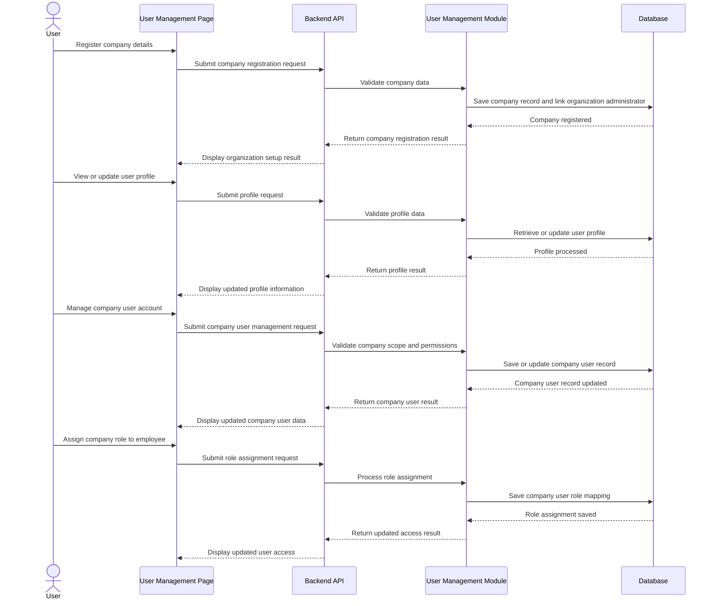

---

### Classes

#### userRouter

Defines the API routes for company registration, user profile management, company user management, and company-scoped role and permission operations. It maps incoming HTTP requests to the appropriate controller functions.

#### userController

Handles user management API requests and responses. It receives requests for company registration, profile updates, company user management, and role assignment, then returns the appropriate response to the client.

#### userService

Contains the business logic for user management operations. It registers companies, links organization administrators to companies, manages company user membership, validates company-scoped roles, and enforces company-based access control rules.

#### userRepository

Handles data access and database queries related to users, companies, roles, permissions, user-role mappings, and role-permission mappings.

#### userValidator

Validates request data for user management operations. It ensures company registration details, profile inputs, role references, permission references, and account status inputs are complete and correctly formatted before processing.

---

### Error Handling

400  
Invalid user management request data

401  
Unauthorized access

403  
Insufficient privileges to manage company users, roles, or permissions

404  
User, company, role, or permission record not found

409  
Company record or role assignment already exists or is in conflicting state

422  
User management validation failed

500  
Internal server error

503  
User management service unavailable

---

## Module 3

Purchase Requisition

---

### Responsibilities

- Handle purchase requisition request creation, submission, and tracking within the procurement system.
- Store requisition details such as requester, items, quantities, purpose, and status.
- Allow authorized users to save, submit, update, and monitor purchase requisition records.
- Maintain links between purchase requisitions and related approval, supplier, and procurement records.
- Provide visibility into requisition progress from draft to final processing status.

### Module Dependencies

- Depends On: Authentication, `users`, `companies`, and `approval_requests` for downstream routing.
- Produces: `purchase_requisitions`, `purchase_requisition_items`, `purchase_requisition_status_logs`, and approval request references.

---

### Functional Requirements

- The system shall allow authorized users to create purchase requisitions for requested goods or services.
- The system shall allow authorized users to add item details, quantities, descriptions, justification, and related request information to a purchase requisition.
- The system shall allow authorized users to save purchase requisitions in draft status before submission.
- The system shall allow authorized users to submit purchase requisitions for further review or approval.
- The system shall allow authorized users to update or revise purchase requisitions while still in an editable status.
- The system shall allow authorized users to view and track purchase requisition status and history.
- The system shall allow authorized users to search and filter purchase requisitions by requester, status, date, or reference number.
- The system shall maintain links between purchase requisitions and downstream procurement records such as approval records, RFQs, or purchase orders where applicable.
- The system shall restrict purchase requisition actions and records to authorized users only.

---

### Business Rules

- Only authorized users shall be allowed to create, update, submit, cancel, or view purchase requisitions based on their assigned roles.
- A purchase requisition must contain at least one valid line item before it can be submitted.
- A purchase requisition shall remain in draft status until it is formally submitted.
- Submitted purchase requisitions shall move to the next workflow stage according to configured approval or procurement rules.
- Purchase requisitions may be edited only while they are in an allowed editable status such as draft or returned for revision.
- Approved or fully processed purchase requisitions shall become read-only to normal users unless a controlled revision process is allowed.
- Cancelled purchase requisitions shall not proceed to downstream procurement processing.
- All significant status changes shall be recorded with the acting user and timestamp.

---

### API Endpoints

POST  
/api/purchase-requisitions  
/api/purchase-requisitions/:requisitionId/submit  
/api/purchase-requisitions/:requisitionId/cancel  
/api/purchase-requisitions/:requisitionId/resubmit

GET  
/api/purchase-requisitions  
/api/purchase-requisitions/:requisitionId  
/api/purchase-requisitions?status=draft  
/api/purchase-requisitions?status=submitted  
/api/purchase-requisitions?requesterId=:requesterId  
/api/purchase-requisitions?referenceNo=:referenceNo

PUT  
/api/purchase-requisitions/:requisitionId  
/api/purchase-requisitions/:requisitionId/status

DELETE  
/api/purchase-requisitions/:requisitionId

---

### Validation

- requisition_number
- requester_id
- company_id
- request_date
- requisition_status
- justification
- total_estimated_amount
- created_by
- submitted_at
- line_items
- Purchase requisition must contain at least one line item
- Each line item must contain a valid item description or item reference
- Each line item must contain a valid quantity
- Request date must be a valid date
- Requester reference must match an existing authorized user
- Submission must be blocked if required requisition data is incomplete
- Status transitions must follow the allowed purchase requisition workflow

---

### Database Tables

- **purchase_requisitions**
  - Stores the main purchase requisition records.
  - Includes requisition number, requester reference, company reference, request date, justification, total estimated amount, status, creator, and submission timestamp.

- **purchase_requisition_items**
  - Stores the line items associated with each purchase requisition.
  - Includes purchase requisition reference, item description or item reference, quantity, estimated unit cost, subtotal, and remarks.

- **purchase_requisition_status_logs**
  - Stores the status history and tracking records for purchase requisitions.
  - Includes purchase requisition reference, previous status, new status, action by, action timestamp, and remarks.

- **Referenced Existing Tables**
  - `users` — stores the users who create, update, submit, cancel, or track purchase requisitions.
  - `companies` — stores the company context associated with the purchase requisition.
  - `approval_requests` — stores related approval workflow records where requisitions are submitted for approval.
  - `rfqs` — stores request for quotation records created from approved requisitions where applicable.
  - `purchase_orders` — stores purchase orders derived from approved requisitions where applicable.

---

### Sequence Diagram

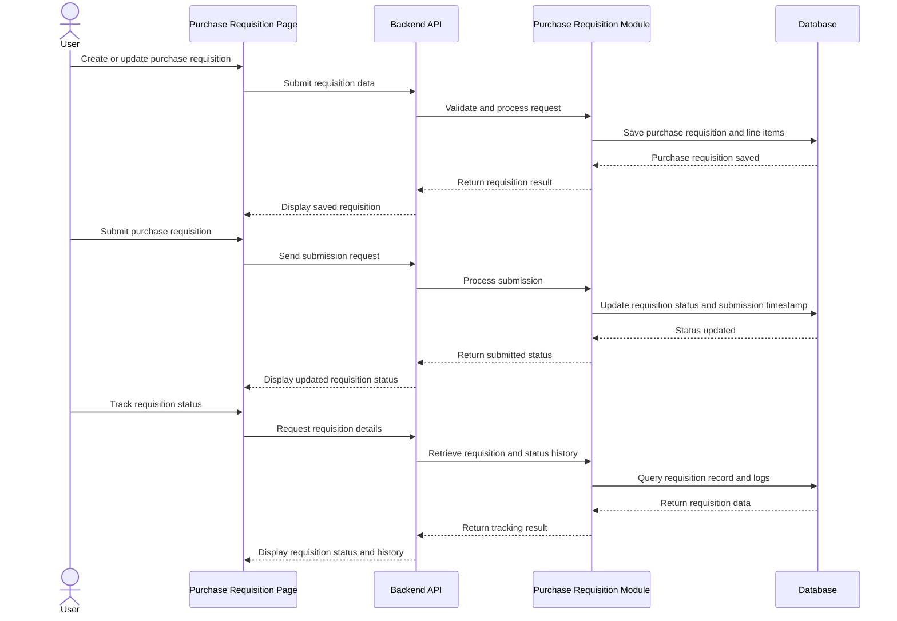

---

### Classes

#### purchaseRequisitionRouter

Defines the API routes for purchase requisition creation, retrieval, updating, submission, cancellation, resubmission, and status tracking. It maps incoming HTTP requests to the appropriate controller functions.

#### purchaseRequisitionController

Handles purchase requisition API requests and responses. It receives requests for creating, updating, submitting, cancelling, resubmitting, and viewing purchase requisitions, then returns the appropriate response to the client.

#### purchaseRequisitionService

Contains the business logic for purchase requisition operations. It validates requisition data, manages requisition status transitions, stores tracking history, and links requisitions to downstream procurement processes.

#### purchaseRequisitionRepository

Handles data access and database queries related to purchase requisitions, requisition line items, and requisition status logs.

#### purchaseRequisitionValidator

Validates request data for purchase requisition operations. It ensures requester references, requisition details, line items, and workflow-related inputs are complete and correctly formatted before processing.

---

### Error Handling

400  
Invalid purchase requisition request data

401  
Unauthorized access

403  
Insufficient privileges to manage purchase requisitions

404  
Purchase requisition or related record not found

409  
Purchase requisition already submitted, cancelled, or in conflicting state

422  
Purchase requisition validation failed

500  
Internal server error

503  
Purchase requisition service unavailable

---

## Module 4

Approval Workflow

---

### Responsibilities

- Handle request review, approval, rejection, and status updates within the system.
- Route requests to the appropriate approver or approval level based on workflow rules.
- Record approval decisions, comments, timestamps, and resulting request statuses.
- Maintain visibility of pending, approved, rejected, and cancelled approval requests.
- Allow authorized users to monitor and process approval workflow actions.

### Module Dependencies

- Depends On: Authentication, `users`, `companies`, and transactional records such as `purchase_requisitions`, `rfqs`, and `purchase_orders`.
- Produces: `approval_requests`, `approval_actions`, and workflow routing outcomes.

---

### Functional Requirements

- The system shall allow authorized users to submit requests for approval.
- The system shall allow the system to route requests to the appropriate approver based on defined workflow rules.
- The system shall allow authorized approvers to review submitted requests and take approval or rejection actions.
- The system shall allow authorized approvers to include remarks or comments during approval or rejection.
- The system shall update the request status after an approval decision is recorded.
- The system shall maintain the request in pending status until all required approvals are completed where multi-level approval is applicable.
- The system shall allow authorized users to cancel or resubmit approval requests where permitted by workflow rules.
- The system shall allow authorized users to view approval history, approval status, and current approver information.
- The system shall restrict approval workflow actions and records to authorized users only.

---

### Business Rules

- Only authorized users shall be allowed to submit, review, approve, reject, cancel, or resubmit approval requests.
- Every approval request must be associated with a valid request record or business transaction.
- A request shall remain in pending approval status until all required approval steps are completed.
- A rejected approval request shall update the related request status to rejected or returned status based on system rules.
- An approved request shall update the related request status to approved or released status based on the workflow outcome.
- Approval or rejection actions must be recorded with the acting approver, timestamp, decision, and remarks where applicable.
- A cancelled approval request may be resubmitted only if allowed by the defined workflow rules.
- Users shall not approve their own request unless explicitly permitted by the system configuration.
- Invalid or incomplete requests shall not proceed to approval processing.

---

### API Endpoints

POST  
/api/approval-workflows/submit  
/api/approval-workflows/:requestId/approve  
/api/approval-workflows/:requestId/reject  
/api/approval-workflows/:requestId/cancel  
/api/approval-workflows/:requestId/resubmit

GET  
/api/approval-workflows  
/api/approval-workflows/:requestId  
/api/approval-workflows?status=pending  
/api/approval-workflows?status=approved  
/api/approval-workflows?status=rejected  
/api/approval-workflows?approverId=:approverId

PUT  
/api/approval-workflows/:requestId/status

---

### Validation

- request_id
- request_type
- requester_id
- approver_id
- approval_level
- approval_status
- decision
- remarks
- submitted_at
- decided_at
- Request must reference a valid business record
- Approver reference must match an authorized user
- Approval status must match an allowed workflow status
- Approval decision must be valid based on the current request state
- Remarks may be required for rejection depending on workflow rules
- Request submission must be blocked if required fields are incomplete
- Status transitions must follow the configured approval workflow sequence

---

### Database Tables

- **approval_requests**
  - Stores the main approval workflow records.
  - Includes request reference, request type, requester, current approval level, current approver, approval status, and submission timestamp.

- **approval_actions**
  - Stores the approval decisions and action history for each approval request.
  - Includes approval request reference, approver, action type, remarks, action timestamp, and resulting status.

- **approval_workflow_levels**
  - Stores the configured approval workflow levels or routing definitions.
  - Includes request type, approval level, assigned approver or role, sequence order, and workflow rules.

- **Referenced Existing Tables**
  - `users` — stores the users who submit, review, approve, reject, cancel, or resubmit requests.
  - `companies` — stores the company context associated with approval requests.
  - Transactional tables such as `purchase_requisitions`, `rfqs`, `purchase_orders`, or other request records — store the business documents subject to approval.

---

### Sequence Diagram

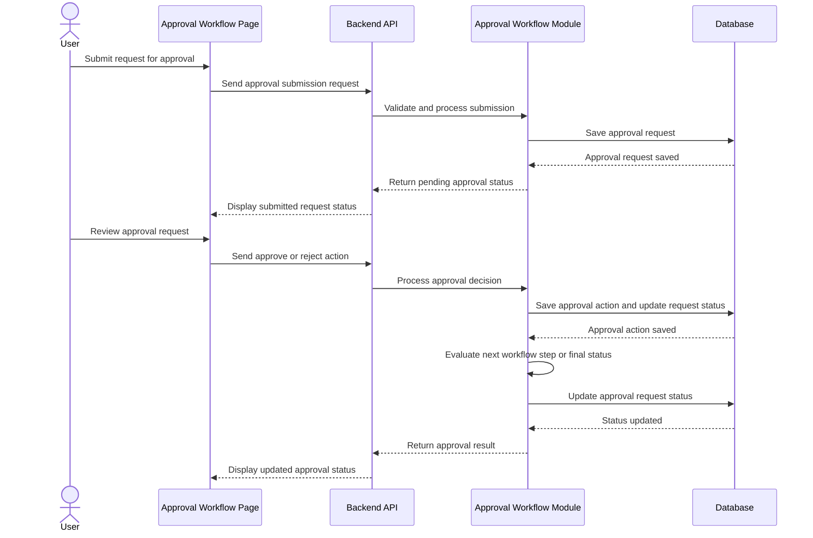

---

### Classes

#### approvalWorkflowRouter

Defines the API routes for approval workflow submission, review, approval, rejection, cancellation, resubmission, and status retrieval. It maps incoming HTTP requests to the appropriate controller functions.

#### approvalWorkflowController

Handles approval workflow API requests and responses. It receives requests for submitting requests, approving, rejecting, cancelling, resubmitting, and viewing approval records, then returns the appropriate response to the client.

#### approvalWorkflowService

Contains the business logic for approval workflow operations. It routes requests to approvers, validates workflow transitions, records approval decisions, updates request statuses, and evaluates multi-level approval outcomes.

#### approvalWorkflowRepository

Handles data access and database queries related to approval workflow requests, approval actions, and workflow level configurations.

#### approvalWorkflowValidator

Validates request data for approval workflow operations. It ensures request references, approver references, decisions, statuses, and workflow inputs are complete and correctly formatted before processing.

---

### Error Handling

400  
Invalid approval workflow request data

401  
Unauthorized access

403  
Insufficient privileges to process approval workflow actions

404  
Approval request or related business record not found

409  
Approval request already processed or in conflicting state

422  
Approval workflow validation failed

500  
Internal server error

503  
Approval workflow service unavailable

---

## Module 5

Supplier Management

---

### Responsibilities

- Manage supplier records, supplier onboarding invitations, and quotation-related information within the procurement system.
- Store and maintain supplier profile details, contact information, business references, and registration status.
- Generate and manage invitation links for supplier onboarding and self-registration.
- Support creation, submission, review, and tracking of supplier quotations.
- Maintain links between suppliers, invitations, quotations, and related procurement documents.
- Allow authorized users to search, view, update, and monitor supplier, invitation, and quotation records.

### Module Dependencies

- Depends On: Authentication, `users`, `companies`, `rfqs`, and `purchase_orders`.
- Produces: `suppliers`, `supplier_invitations`, `supplier_quotations`, and `supplier_quotation_items`.

---

### Functional Requirements

- The system shall allow authorized users to create, view, update, and archive supplier records.
- The system shall allow authorized users to store supplier details such as company name, contact person, address, email, phone number, and status.
- The system shall allow authorized users to generate supplier invitation links for onboarding or self-registration.
- The system shall allow authorized users to send supplier invitations through the configured communication channel.
- The system shall allow the system to track invitation status such as not sent, invited, opened, in progress, expired, completed, or approved.
- The system shall allow authorized users to resend or regenerate supplier invitation links when necessary.
- The system shall allow invited suppliers to complete registration using the invitation link.
- The system shall update the supplier registration status after onboarding actions are performed.
- The system shall allow authorized users to record and manage quotations submitted by suppliers.
- The system shall allow authorized users to link supplier quotations to related requests for quotation and procurement transactions.
- The system shall allow authorized users to view quotation details such as offered items, prices, quantities, terms, and submission date.
- The system shall allow authorized users to compare quotations from different suppliers for the same procurement requirement.
- The system shall allow authorized users to search and filter suppliers, invitations, and quotations by name, status, date, or related document reference.
- The system shall restrict supplier, invitation, and quotation management functions to authorized users only.

---

### Business Rules

- Only authorized users shall be allowed to create, update, archive, invite, or view supplier records and quotations.
- Each supplier record must contain unique and valid identifying information before it can be saved.
- A supplier invitation must be associated with an existing supplier record or an authorized new supplier entry.
- Each supplier invitation link must be unique and time-bound according to the configured expiration policy.
- Expired or invalid invitation links shall not allow supplier registration completion.
- Supplier registration status shall progress only through valid onboarding states defined by the system.
- Archived or inactive suppliers shall not be available for new procurement transactions unless reactivated by an authorized user.
- A quotation must be associated with an existing supplier record.
- A quotation must be associated with a valid procurement reference where applicable.
- Supplier quotations shall remain read-only after final submission unless revision is allowed through an authorized process.
- Quotation comparisons must use quotation records linked to the same procurement requirement or request.
- Deleting supplier records through normal application functions shall not be allowed if related invitations, quotations, or procurement transactions already exist.

---

### API Endpoints

POST  
/api/suppliers  
/api/suppliers/:supplierId/invite  
/api/suppliers/:supplierId/resend-invite  
/api/suppliers/:supplierId/quotations  
/api/suppliers/:supplierId/archive  
/api/supplier-invitations/validate/:token

GET  
/api/suppliers  
/api/suppliers/:supplierId  
/api/suppliers?status=active  
/api/suppliers?status=invited  
/api/suppliers?name=:supplierName  
/api/suppliers/:supplierId/invitations  
/api/suppliers/:supplierId/quotations  
/api/quotations/:quotationId  
/api/quotations?rfqId=:rfqId

PUT  
/api/suppliers/:supplierId  
/api/supplier-invitations/:invitationId/status  
/api/quotations/:quotationId

DELETE  
/api/quotations/:quotationId

---

### Validation

- supplier_name
- contact_person
- email
- phone_number
- address
- supplier_status
- registration_status
- invitation_email
- invitation_token
- invitation_status
- expires_at
- quotation_id
- rfq_id
- quotation_date
- quotation_total
- quotation_status
- Supplier name must not be empty
- Email must be in a valid format
- Phone number must be in a valid format
- Supplier record must contain required contact and identification details
- Invitation email must be valid before an invitation link is generated
- Invitation token must be unique
- Invitation expiration date must be a valid future date at the time of generation
- Expired or invalid invitation tokens must be rejected
- Quotation must reference an existing supplier
- Quotation total must be a valid numeric value
- Quotation date must be a valid date
- Quotation submission must be blocked if required supplier or quotation details are incomplete

---

### Database Tables

- **suppliers**
  - Stores the main supplier records.
  - Includes supplier name, contact person, email, phone number, address, status, registration status, and related company information.

- **supplier_invitations**
  - Stores onboarding invitation records for suppliers.
  - Includes supplier reference, invitation email, invitation token, invitation status, sent timestamp, opened timestamp, expiration timestamp, and completion timestamp.

- **supplier_quotations**
  - Stores quotations submitted or recorded for suppliers.
  - Includes supplier reference, related procurement reference, quotation date, total amount, status, terms, and remarks.

- **supplier_quotation_items**
  - Stores the line items included in each supplier quotation.
  - Includes quotation reference, item description or item reference, quantity, unit price, subtotal, and remarks.

- **Referenced Existing Tables**
  - `users` — stores the users who create, update, review, invite, or compare supplier and quotation records.
  - `companies` — stores the company context associated with supplier management records.
  - `rfqs` — stores the request for quotation records linked to supplier quotations.
  - `purchase_orders` — stores purchase orders that may reference selected supplier quotations where applicable.

---

### Sequence Diagram

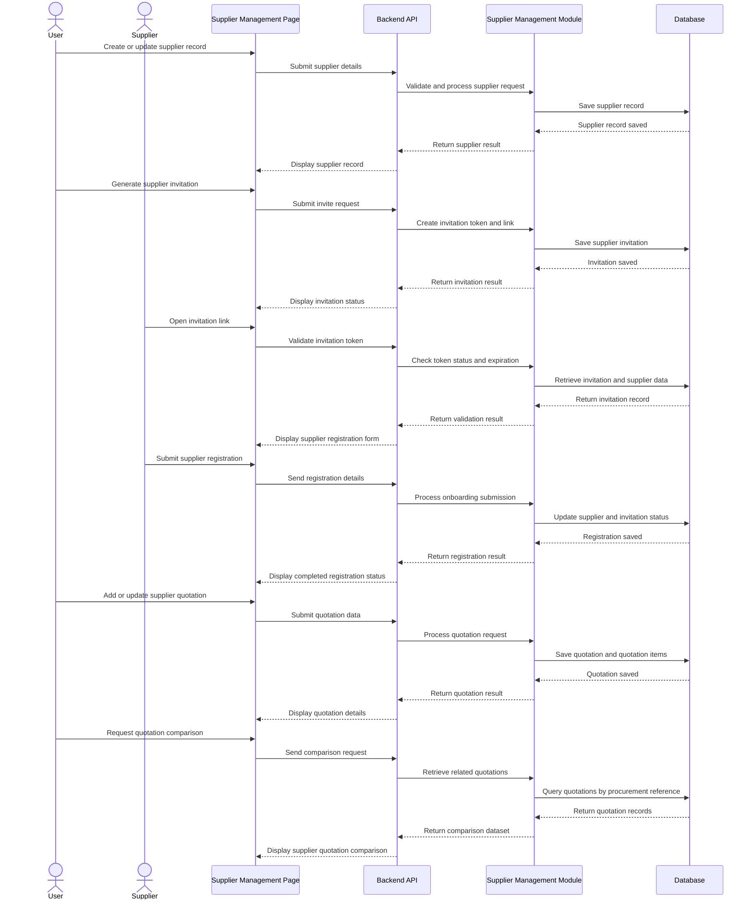

---

### Classes

#### supplierRouter

Defines the API routes for supplier, supplier invitation, and quotation operations. It maps incoming HTTP requests to the appropriate controller functions.

#### supplierController

Handles supplier management API requests and responses. It receives requests for creating, updating, viewing, archiving suppliers, generating invitations, validating invitations, and managing quotations, then returns the appropriate response to the client.

#### supplierService

Contains the business logic for supplier management operations. It manages supplier records, generates invitation links, validates onboarding tokens, updates supplier registration status, retrieves quotation comparisons, and enforces supplier-related business rules.

#### supplierRepository

Handles data access and database queries related to supplier records, supplier invitations, supplier quotations, and quotation line items.

#### supplierValidator

Validates request data for supplier, invitation, and quotation operations. It ensures supplier details, invitation inputs, quotation references, totals, and related fields are complete and correctly formatted before processing.

---

### Error Handling

400  
Invalid supplier, invitation, or quotation request data

401  
Unauthorized access

403  
Insufficient privileges to manage suppliers, invitations, or quotations

404  
Supplier, invitation, or quotation record not found

409  
Supplier record already exists or resource is in conflicting state

410  
Supplier invitation link expired

422  
Supplier onboarding or quotation validation failed

500  
Internal server error

503  
Supplier management service unavailable

---

## Module 6

Purchase Order Management

---

### Responsibilities

- Create, manage, and track purchase orders within the procurement process.
- Store purchase order details including supplier, items, quantities, prices, totals, and status.
- Support submission, review, approval, and updating of purchase orders by authorized users.
- Maintain purchase order records linked to related procurement documents and supplier information.
- Provide status visibility for draft, submitted, approved, rejected, and completed purchase orders.

### Module Dependencies

- Depends On: Authentication, `users`, `companies`, `suppliers`, `purchase_requisitions`, and `quotations`.
- Produces: `purchase_orders`, `purchase_order_items`, and `purchase_order_approvals`.

---

### Functional Requirements

- The system shall allow authorized users to create purchase orders based on approved procurement data or manual entry.
- The system shall allow authorized users to add supplier information, item details, quantities, prices, and totals to a purchase order.
- The system shall allow authorized users to save purchase orders in draft status before submission.
- The system shall allow authorized users to submit purchase orders for approval.
- The system shall allow authorized approvers to approve or reject submitted purchase orders.
- The system shall update the purchase order status based on user actions and workflow outcomes.
- The system shall allow authorized users to view, search, and filter purchase orders by supplier, date, status, or reference number.
- The system shall maintain links between purchase orders and related requisitions, quotations, or supplier records where applicable.

---

### Business Rules

- Only authorized users shall be allowed to create, edit, submit, approve, or reject purchase orders based on their assigned roles.
- A purchase order must contain a valid supplier before it can be submitted.
- A purchase order must contain at least one valid line item before submission.
- Purchase order totals must be computed from the associated line items.
- Approved purchase orders shall become read-only to normal users unless an authorized revision or change process is allowed.
- Rejected purchase orders may be edited and resubmitted by authorized users.
- A purchase order shall not be marked as completed unless the related procurement process has reached the required completion state.
- All approval or rejection actions must be recorded with the acting user, timestamp, and resulting status.

---

### API Endpoints

POST  
/api/purchase-orders  
/api/purchase-orders/:poId/submit  
/api/purchase-orders/:poId/approve  
/api/purchase-orders/:poId/reject

GET  
/api/purchase-orders  
/api/purchase-orders/:poId  
/api/purchase-orders?status=approved  
/api/purchase-orders?supplierId=:supplierId  
/api/purchase-orders?referenceNo=:referenceNo

PUT  
/api/purchase-orders/:poId  
/api/purchase-orders/:poId/status

DELETE  
/api/purchase-orders/:poId

---

### Validation

- po_number
- supplier_id
- company_id
- order_date
- status
- total_amount
- created_by
- approved_by
- approval_timestamp
- line_items
- Purchase order must contain a valid supplier reference
- Purchase order must contain at least one line item
- Each line item must contain a valid item description or item reference
- Each line item must contain a valid quantity and unit price
- Total amount must equal the computed sum of all purchase order line items
- Approval action must be blocked if required purchase order data is incomplete
- Status transitions must follow the allowed purchase order workflow

---

### Database Tables

- **purchase_orders**
  - Stores the main purchase order records.
  - Includes purchase order number, supplier reference, company reference, order date, total amount, status, creator, approver, and approval timestamp.

- **purchase_order_items**
  - Stores the line items associated with each purchase order.
  - Includes purchase order reference, item description or item reference, quantity, unit price, subtotal, and remarks.

- **purchase_order_approvals**
  - Stores approval and rejection actions related to purchase orders.
  - Includes purchase order reference, approver, action type, remarks, action timestamp, and resulting status.

- **Referenced Existing Tables**
  - `suppliers` — stores supplier information linked to purchase orders.
  - `users` — stores the users who create, update, submit, approve, or reject purchase orders.
  - `companies` — stores the company context associated with the purchase order.
  - `purchase_requisitions` or `rfqs` — stores upstream procurement records referenced by the purchase order where applicable.
  - `quotations` — stores supplier quotation data used as the basis for selected purchase order details where applicable.

---

### Sequence Diagram

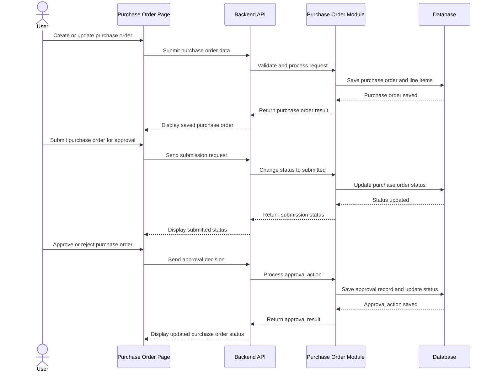

---

### Classes

#### purchaseOrderRouter

Defines the API routes for purchase order creation, retrieval, updating, submission, approval, rejection, and deletion. It maps incoming HTTP requests to the appropriate controller functions.

#### purchaseOrderController

Handles purchase order API requests and responses. It receives requests for creating, updating, submitting, approving, rejecting, and viewing purchase orders, then returns the appropriate response to the client.

#### purchaseOrderService

Contains the business logic for purchase order operations. It validates purchase order data, computes totals, manages workflow status changes, and coordinates approval or rejection actions.

#### purchaseOrderRepository

Handles data access and database queries related to purchase orders, line items, and approval records.

#### purchaseOrderValidator

Validates request data for purchase order operations. It ensures supplier references, line items, totals, and workflow actions are complete and correctly formatted before processing.

---

### Error Handling

400  
Invalid purchase order request data

401  
Unauthorized access

403  
Insufficient privileges to manage purchase orders

404  
Purchase order or related record not found

409  
Purchase order already submitted, approved, or in conflicting state

422  
Purchase order validation failed

500  
Internal server error

503  
Purchase order service unavailable

---

## Module 7

Delivery Verification

---

### Responsibilities

- Verify that a delivery associated with a procurement transaction has been delivered.
- Notify the company or responsible users that the delivery has already been received.
- Record delivery confirmation details, timestamps, and related verification status.
- Maintain links between delivery verification records and related purchase orders, suppliers, and receiving data.
- Allow authorized users to review, confirm, and monitor delivery verification records.

### Module Dependencies

- Depends On: Authentication, `users`, `companies`, `purchase_orders`, and `suppliers`.
- Produces: `delivery_verifications` and `delivery_notifications`.

---

### Functional Requirements

- The system shall allow authorized users to record delivery verification for a related procurement transaction.
- The system shall allow the system to notify the company or designated users once a delivery is confirmed as delivered.
- The system shall allow authorized users to view delivery verification details including delivery date, confirmation status, and related references.
- The system shall allow the system to link a delivery verification record to the related purchase order and supplier record.
- The system shall allow authorized users to update the delivery verification status when supporting confirmation data is available.
- The system shall allow the system to store remarks, notification details, and timestamps related to delivery verification.
- The system shall allow authorized users to search and filter delivery verification records by status, supplier, purchase order, or delivery date.
- The system shall restrict delivery verification actions and records to authorized users only.

---

### Business Rules

- Only authorized users shall be allowed to create, update, or view delivery verification records.
- A delivery verification record must be associated with a valid purchase order or related procurement reference.
- Delivery verification shall not be marked as confirmed without a valid related supplier and transaction reference.
- The system shall notify the company or assigned responsible user after successful delivery confirmation.
- A delivery verification record must store the confirmation timestamp and resulting status.
- Delivery verification records shall be maintained in read-only mode after final confirmation unless a controlled update process is allowed.
- Duplicate delivery confirmation for the same delivery reference shall not be allowed unless explicitly permitted by the system.
- If delivery confirmation data is incomplete, the delivery verification record shall remain pending or flagged for review.

---

### API Endpoints

POST  
/api/delivery-verifications  
/api/delivery-verifications/:deliveryId/confirm  
/api/delivery-verifications/:deliveryId/notify

GET  
/api/delivery-verifications  
/api/delivery-verifications/:deliveryId  
/api/delivery-verifications?status=confirmed  
/api/delivery-verifications?status=pending  
/api/delivery-verifications?purchaseOrderId=:poId  
/api/delivery-verifications?supplierId=:supplierId

PUT  
/api/delivery-verifications/:deliveryId/status

---

### Validation

- delivery_id
- purchase_order_id
- supplier_id
- delivery_date
- delivery_status
- confirmation_status
- confirmed_by
- confirmation_timestamp
- notification_status
- remarks
- Delivery verification must reference a valid purchase order
- Supplier reference must match an existing supplier record
- Delivery date must be a valid date
- Confirmation status must match an allowed verification status
- Notification shall not be marked as sent unless delivery confirmation is successful
- Duplicate confirmed delivery references must be blocked unless reprocessing is allowed
- Required delivery confirmation data must be complete before final confirmation

---

### Database Tables

- **delivery_verifications**
  - Stores the main delivery verification records.
  - Includes delivery reference, purchase order reference, supplier reference, delivery date, confirmation status, remarks, confirmed by, and confirmation timestamp.

- **delivery_notifications**
  - Stores notification records related to verified deliveries.
  - Includes delivery verification reference, notification recipient, notification channel, notification status, sent timestamp, and related remarks.

- **Referenced Existing Tables**
  - `purchase_orders` — stores the purchase order records linked to the delivery being verified.
  - `suppliers` — stores the supplier information associated with the delivery.
  - `users` — stores the user who confirmed the delivery or received the notification.
  - `companies` — stores the company context for the verified delivery.
  - `goods_receipts` or `receiving_reports` — stores supporting receipt or receiving information where applicable.

---

### Sequence Diagram

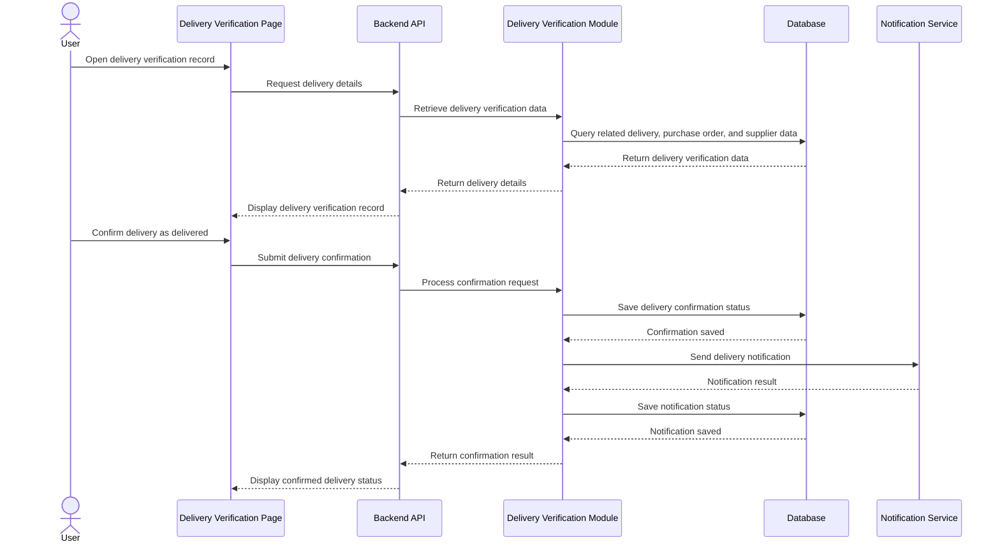

---

### Classes

#### deliveryVerificationRouter

Defines the API routes for delivery verification, confirmation, notification, and retrieval operations. It maps incoming HTTP requests to the appropriate controller functions.

#### deliveryVerificationController

Handles delivery verification API requests and responses. It receives requests for listing, viewing, confirming, notifying, and updating delivery verification records, then returns the appropriate response to the client.

#### deliveryVerificationService

Contains the business logic for delivery verification operations. It validates delivery references, confirms delivered status, stores confirmation details, triggers notifications, and enforces delivery-related business rules.

#### deliveryVerificationRepository

Handles data access and database queries related to delivery verification records and delivery notification records.

#### deliveryVerificationValidator

Validates request data for delivery verification operations. It ensures purchase order references, supplier references, delivery details, confirmation inputs, and notification-related fields are complete and correctly formatted before processing.

---

### Error Handling

400  
Invalid delivery verification request data

401  
Unauthorized access

403  
Insufficient privileges to access delivery verification

404  
Delivery verification record or related reference not found

409  
Delivery already confirmed or conflicting delivery status

422  
Delivery confirmation validation failed

500  
Internal server error

503  
Notification or delivery verification service unavailable

---

## Module 8

Invoice Verification

---

### Responsibilities

- Verify whether uploaded invoice records match the related purchase order, vendor information, and supporting transaction data.
- Compare invoice details against procurement and receiving records before approval or further processing.
- Detect mismatches in quantities, prices, totals, vendor references, and document relationships.
- Record the verification status and remarks for each processed invoice.
- Support authorized users in reviewing, validating, and resolving invoice discrepancies.

### Module Dependencies

- Depends On: Authentication, `users`, `companies`, `purchase_orders`, `suppliers`, and supporting receipt records such as `goods_receipts` or `receiving_reports`.
- Produces: `invoice_verifications`, `invoice_verification_items`, and `invoice_verification_attachments`.

---

### Functional Requirements

- The system shall allow authorized users to upload or submit invoice records for verification.
- The system shall retrieve the related purchase order, vendor information, and supporting transaction data linked to the invoice.
- The system shall compare invoice fields such as supplier, line items, quantities, prices, totals, and reference numbers with the related records.
- The system shall determine whether the invoice matches the related procurement records based on defined validation rules.
- The system shall mark the invoice as verified, flagged, or rejected depending on the verification result.
- The system shall allow authorized users to view mismatch details and verification remarks.
- The system shall store verification results, timestamps, and the responsible user for traceability.
- The system shall restrict invoice verification actions to authorized users only.

---

### Business Rules

- Only authorized users shall be allowed to verify uploaded invoices.
- An invoice must be matched against its related purchase order before it can be marked as verified.
- Vendor information in the invoice must match the vendor information in the related procurement record.
- Invoice quantities, unit prices, and totals must be consistent with the related purchase order and supporting transaction data.
- If a required related record is missing, the invoice shall be flagged for review and must not be marked as verified.
- Invoices with mismatched totals, quantities, or vendor details shall not proceed as verified until resolved.
- Verification actions must be recorded with the acting user, timestamp, and resulting status.
- Verified invoice records shall remain read-only to normal users unless a controlled re-verification process is allowed.

---

### API Endpoints

POST  
/api/invoice-verifications/upload  
/api/invoice-verifications/verify/:invoiceId  
/api/invoice-verifications/recheck/:invoiceId

GET  
/api/invoice-verifications  
/api/invoice-verifications/:invoiceId  
/api/invoice-verifications?status=verified  
/api/invoice-verifications?status=flagged  
/api/invoice-verifications?vendorId=:vendorId  
/api/invoice-verifications?purchaseOrderId=:purchaseOrderId

---

### Validation

- invoice_id
- purchase_order_id
- vendor_id
- invoice_number
- invoice_date
- invoice_total
- verification_status
- uploaded_file
- verified_by
- verification_timestamp
- Invoice record must contain a valid related purchase order reference
- Vendor reference must match an existing vendor record
- Invoice total must be a valid numeric value
- Invoice date must be a valid date
- Uploaded invoice file must be present before verification if file submission is required
- Verification must be blocked if required matching records are incomplete or missing
- Invoice line items must contain valid quantity and price values where applicable

---

### Database Tables

- **invoice_verifications**
  - Stores the main invoice verification records and verification results.
  - Includes invoice reference, purchase order reference, vendor reference, verification status, remarks, verified by, and verification timestamp.

- **invoice_verification_items**
  - Stores detailed line-level comparison results between invoice entries and related purchase order or transaction records.
  - Includes item description, expected quantity, invoiced quantity, expected price, invoiced price, and mismatch indicators.

- **invoice_verification_attachments**
  - Stores uploaded invoice files and related attachment metadata.
  - Includes invoice verification reference, file name, file path, file type, and upload timestamp.

- **Referenced Existing Tables**
  - `purchase_orders` — stores the purchase order records used as the primary reference for invoice matching.
  - `suppliers` — stores vendor or supplier information used for vendor validation.
  - `goods_receipts` or `receiving_reports` — stores supporting receipt or delivery data used to confirm delivered items where applicable.
  - `users` — stores the user who uploaded, reviewed, or verified the invoice.
  - `companies` — stores the company context associated with the invoice and procurement records.

---

### Sequence Diagram

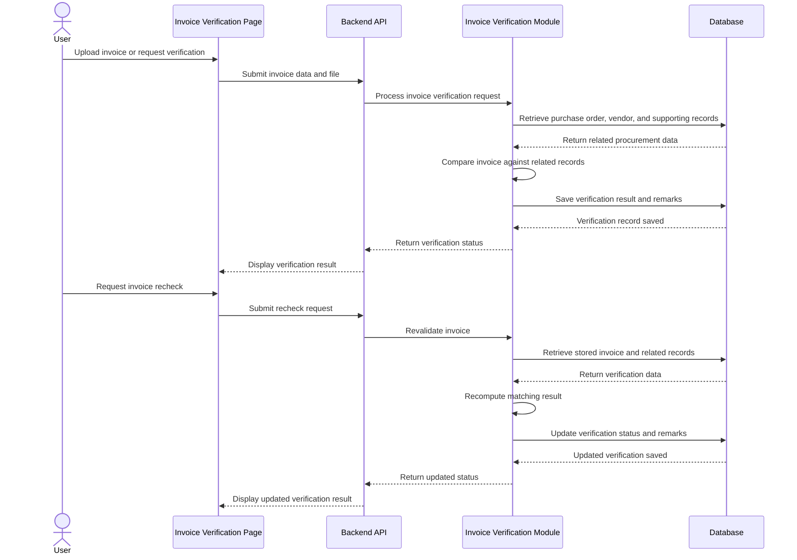

---

### Classes

#### invoiceVerificationRouter

Defines the API routes for invoice upload, verification, rechecking, and retrieval operations. It maps incoming HTTP requests to the appropriate controller functions.

#### invoiceVerificationController

Handles invoice verification API requests and responses. It receives requests for uploading invoices, checking matches, revalidating records, and viewing verification results, then returns the appropriate response to the client.

#### invoiceVerificationService

Contains the business logic for invoice verification operations. It retrieves related procurement records, compares invoice data against purchase orders and vendor details, determines verification results, and stores mismatch findings.

#### invoiceVerificationRepository

Handles data access and database queries related to invoice verification records, line-level comparison results, and invoice attachments.

#### invoiceVerificationValidator

Validates request data for invoice verification operations. It ensures invoice references, vendor references, purchase order links, uploaded files, and verification inputs are complete and correctly formatted before processing.

---

### Error Handling

400  
Invalid invoice verification request data

401  
Unauthorized access

403  
Insufficient privileges to verify invoices

404  
Invoice record or related purchase order not found

409  
Invoice already verified or conflicting verification state

422
Invoice mismatch detected or verification failed

500  
Internal server error

503  
Verification service unavailable

---

## Module 9

Reporting

---

### Responsibilities

- Display dashboards, summaries, and procurement reports for authorized users.
- Consolidate procurement-related data from multiple modules into readable report outputs.
- Provide filtered, searchable, and exportable views of reporting data.
- Present key performance indicators, totals, statuses, and trends relevant to procurement operations.
- Support generation of periodic and on-demand reports for decision-making and monitoring.

### Module Dependencies

- Depends On: Authentication, `users`, `companies`, and transactional tables across requisitions, approvals, suppliers, quotations, purchase orders, delivery verification, invoice verification, and audit trails.
- Produces: `report_requests`, `report_exports`, and report output datasets.

---

### Functional Requirements

- The system shall display dashboard data summarizing procurement activities and record statuses.
- The system shall generate procurement reports based on available transactional data.
- The system shall allow authorized users to filter reports by date range, status, supplier, company, and document type.
- The system shall allow authorized users to view summary counts, totals, and breakdowns for procurement records.
- The system shall allow authorized users to export report results in supported formats.
- The system shall allow authorized users to view detailed report entries behind summarized dashboard values.
- The system shall retrieve reporting data from relevant procurement and reference tables.
- The system shall restrict report access based on user authorization and scope.

---

### Business Rules

- Only authorized users shall be allowed to access dashboards and reports.
- Reporting data shall be generated from existing approved or recorded system transactions.
- Report results must reflect the latest saved data available at the time of generation.
- Filters applied by the user shall affect only the requested report view and shall not modify source records.
- Summary values in dashboards must be derived from the same underlying transactional data used in detailed reports.
- Exported reports must match the filtered data currently displayed or requested by the user.
- Reports shall be generated in read-only mode and must not allow direct editing of transactional records.
- If no matching data is found, the system shall return an empty result set instead of invalid values.

---

### API Endpoints

POST  
/api/reports/export

GET  
/api/reports/dashboard  
/api/reports/procurement-summary  
/api/reports/procurement-status  
/api/reports/purchase-orders  
/api/reports/rfqs  
/api/reports/quotations  
/api/reports?dateFrom=YYYY-MM-DD&dateTo=YYYY-MM-DD  
/api/reports?status=approved  
/api/reports?supplierId=:supplierId

---

### Validation

- date_from
- date_to
- report_type
- format
- status
- supplier_id
- company_id
- document_type
- Date range must be valid and `date_from` must not be later than `date_to`
- Report type must match a supported reporting category
- Export format must match an allowed output type
- Filter values must reference existing and authorized records where applicable
- Dashboard and report requests must only return data within the requesting user's allowed scope

---

### Database Tables

- **report_requests**
  - Stores generated or requested report metadata when report generation is logged.
  - Includes requesting user, report type, applied filters, generation timestamp, and output format.

- **report_exports**
  - Stores exported report file references and related export details.
  - Includes report request reference, file name, format, generated path, and export timestamp.

- **Referenced Existing Tables**
  - `rfqs` — stores request for quotation records used in procurement reporting.
  - `quotations` — stores supplier quotation records used in comparative and summary reporting.
  - `purchase_orders` — stores purchase order records used in status and total amount reports.
  - `suppliers` — stores supplier information used in supplier-based reporting filters and summaries.
  - `users` — stores the user requesting or viewing the report.
  - `companies` — stores the company context for report scope and filtering.

---

### Sequence Diagram

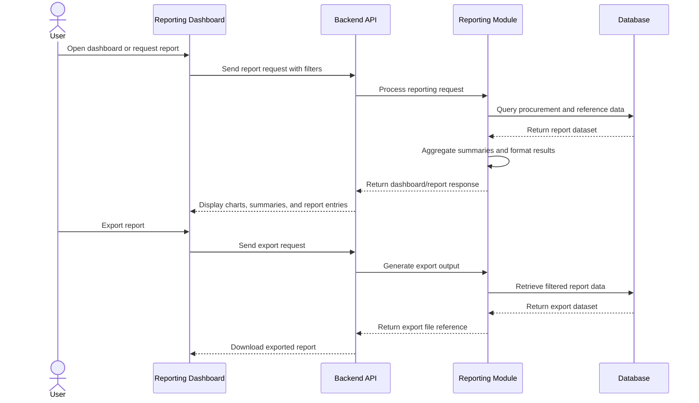

---

### Classes

#### reportingRouter

Defines the API routes for dashboard, summary, report viewing, and export operations. It maps incoming reporting requests to the appropriate controller functions.

#### reportingController

Handles reporting-related API requests and responses. It receives requests for dashboards, filtered reports, and exports, then returns the appropriate data or file response to the client.

#### reportingService

Contains the business logic for reporting operations. It retrieves procurement data, applies filters, computes summaries, prepares dashboard metrics, and generates exportable report outputs.

#### reportingRepository

Handles data access and database queries related to report generation. It retrieves procurement records, summary datasets, and report-related metadata from the database.

#### reportingValidator

Validates request data for reporting operations. It ensures filters, date ranges, report types, and export parameters are complete, correctly formatted, and authorized before processing.

---

### Error Handling

400  
Invalid report request data

401  
Unauthorized access

403  
Insufficient privileges to access reports

404  
Report data not found

422  
Invalid filter range or unsupported report type

500  
Internal server error

503  
Report generation service unavailable

---

## Module 10

Audit Trail

---

### Responsibilities

- Record significant user and system actions performed within the application.
- Maintain a chronological and tamper-evident history of transactions and record changes.
- Generate cryptographic hashes of audit records for blockchain verification.
- Store blockchain transaction references associated with verified audit trail entries.
- Allow authorized users to view and verify audit records and related blockchain status.

### Module Dependencies

- Depends On: Authentication, `users`, `companies`, all transactional modules, and the configured blockchain network.
- Produces: `audit_trails`, `audit_trail_hashes`, and `audit_trail_blockchain_refs`.

---

### Functional Requirements

- The system shall record important user and system actions as audit trail entries.
- The system shall capture details such as user, action performed, affected module, affected record, timestamp, and related metadata.
- The system shall generate a hash value for each audit trail entry or grouped audit transaction.
- The system shall submit the generated hash to the configured blockchain network for verification.
- The system shall store the resulting blockchain transaction reference together with the related audit trail record.
- The system shall allow authorized users to view audit trail entries and their blockchain verification status.
- The system shall allow authorized users to verify whether an audit trail entry matches its recorded blockchain hash.
- The system shall restrict audit trail access to authorized users only.

---

### Business Rules

- Only significant user and system actions shall be recorded in the audit trail.
- Every audit trail entry must contain the acting user, action type, affected module, timestamp, and affected record reference when applicable.
- An audit trail entry must not be editable or deletable through normal application functions.
- Each audit trail entry or audit batch must generate a unique cryptographic hash before blockchain submission.
- The blockchain transaction hash or reference shall be stored after successful blockchain anchoring.
- Audit trail verification shall compare the current audit record hash with the blockchain-anchored hash.
- Only authorized users may access and review audit trail records.
- Failed blockchain submissions shall not remove the original audit trail record from the application database.
- Audit records shall remain available even if blockchain verification is temporarily unavailable.

---

### API Endpoints

POST
/api/audit-trails/verify/:auditId
/api/audit-trails/blockchain-anchor

GET
/api/audit-trails
/api/audit-trails/:auditId
/api/audit-trails?module=procurement
/api/audit-trails?status=verified
/api/audit-trails?status=pending

---

### Validation

- user_id
- action_type
- module_name
- record_id
- record_type
- action_timestamp
- hash_value
- blockchain_network
- blockchain_tx_hash
- Verification blocked if required audit data is incomplete
- Blockchain anchoring blocked if hash value is missing
- Blockchain transaction reference must be stored only after a successful submission response
- Audit trail entry must contain valid module and action references

---

### Database Tables

- **audit_trails**
  - Stores the main audit trail records for significant user and system actions.
  - Includes user identifier, action type, module name, affected record reference, timestamp, status, and metadata.

- **audit_trail_hashes**
  - Stores the cryptographic hash generated for an audit trail entry or audit batch.
  - Used for integrity checking and blockchain verification.

- **audit_trail_blockchain_refs**
  - Stores blockchain-related references linked to audit trail records.
  - Includes blockchain network name, transaction hash, block number, verification status, and anchoring timestamp.

- **Referenced Existing Tables**
  - `users` — stores the user account associated with the recorded action.
  - `companies` — stores the company or organization related to the action where applicable.
  - `rfqs`, `quotations`, `purchase_orders`, and other transactional tables — store the business records referenced by the audit trail.

---

### Sequence Diagram

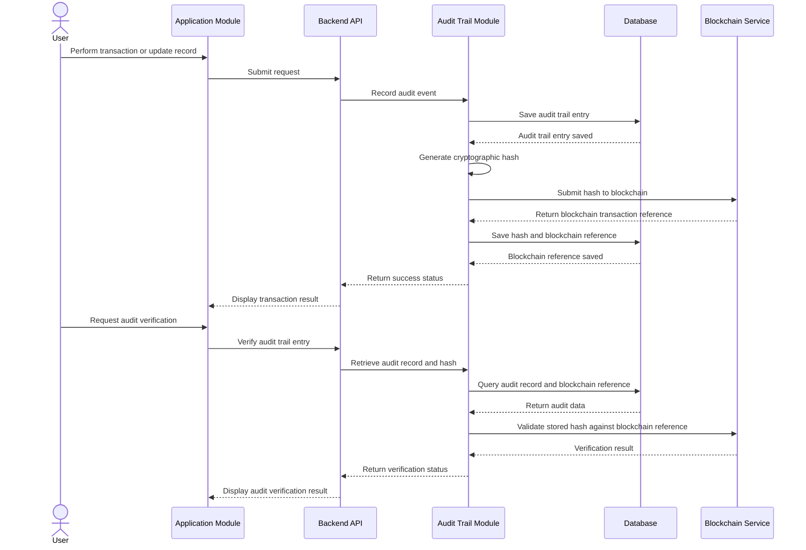

---

### Classes

#### auditTrailRouter
Defines the API routes for audit trail operations. It maps incoming HTTP requests to the appropriate controller functions.

#### auditTrailController
Handles audit trail API requests and responses. It receives requests for listing, viewing, anchoring, and verifying audit records, then returns the appropriate response to the client.

#### auditTrailService
Contains the business logic for audit trail operations. It records actions, generates cryptographic hashes, initiates blockchain anchoring, and verifies audit entries against blockchain references.

#### auditTrailRepository
Handles data access and database queries related to audit trail records, generated hashes, and blockchain transaction references.

#### auditTrailValidator
Validates request data for audit trail operations. It ensures required audit fields, hash values, and verification inputs are complete and correctly formatted before processing.

---

### Error Handling

400
Invalid audit request data

401
Unauthorized access

403
Insufficient privileges to access audit trails

404
Audit trail record not found

409
Audit trail already anchored or conflicting blockchain reference

422
Audit verification failed

500
Internal server error

503
Blockchain service unavailable

---

## Module 11

Organization Administration

---

### Responsibilities

- Manage user accounts within the organization.
- Assign organization-level roles and permissions to company users.
- Maintain organization-specific settings and administrative controls.
- Monitor organization-level administrative actions through audit logs.
- Restrict administrative functions to authorized users within the organization only.

### Module Dependencies

- Depends On: Authentication, `users`, `companies`, `roles`, `permissions`, and `audit_logs`.
- Produces: organization user mappings, role assignments, permissions, settings, and administrative audit records.

---

### Functional Requirements

- The organization administrator shall be able to create, update, deactivate, and view user accounts within the organization.
- The organization administrator shall be able to assign and modify roles and permissions for users within the organization.
- The organization administrator shall be able to configure organization-specific settings required for company operations.
- The organization administrator shall be able to view audit logs of important administrative activities within the organization.
- The system shall restrict organization administration pages and functions to authorized users within the same organization only.
- The system shall record significant administrative changes such as user updates, role assignments, and organization setting changes.

---

### Business Rules

- Only authorized organization administrators may access the Organization Administration module.
- An organization administrator may create, modify, or deactivate only the user accounts belonging to the same organization.
- A user account must be assigned an appropriate organization role before the account can access protected organization functions.
- Administrative changes to user access, roles, and organization settings must be recorded in the audit log.
- An organization administrator shall not access or modify users, settings, or records belonging to another organization.
- Deactivated users shall not be allowed to log in or access protected organization features.
- Organization settings shall not be changed without appropriate organization-level permission.

---

### API Endpoints

POST
/api/org-admin/users
/api/org-admin/roles
/api/org-admin/settings

GET
/api/org-admin/users
/api/org-admin/users/:userId
/api/org-admin/roles
/api/org-admin/settings
/api/org-admin/audit-logs

PUT
/api/org-admin/users/:userId
/api/org-admin/roles/:roleId
/api/org-admin/settings/:settingId

PATCH
/api/org-admin/users/:userId/status

---

### Validation

- first_name
- last_name
- email
- password
- role_id
- account_status
- setting_key
- setting_value
- organization_id
- Audit log entry required for administrative updates when applicable
- Submission blocked if required administrative fields are incomplete
- Email must be in valid format
- Password must satisfy system security requirements
- Role assignment must reference an existing valid role within the organization

---

### Database Tables

- **organization_users**
  - Stores the relationship between users and the organization.
  - Used to determine which users belong to a specific organization.

- **organization_roles**
  - Stores organization-level roles such as company owner, chief procurement officer, procurement officer, and company administrator.
  - Used to define access levels within a specific organization.

- **organization_permissions**
  - Stores the available permissions for organization users and modules.
  - Used to define allowed actions within the organization scope.

- **organization_role_permissions**
  - Stores the mapping between organization roles and permissions.
  - Used to determine what actions are allowed for each assigned organization role.

- **organization_settings**
  - Stores configurable settings for a specific organization.
  - Used to maintain organization-level operational configurations.

- **audit_logs**
  - Stores records of important user and administrative actions within the organization.
  - Includes user identifier, organization identifier, action performed, affected record, timestamp, and related details.

- **Referenced Existing Tables**
  - `users` — stores authentication and account ownership data.
  - `companies` — stores organization records.

---

### Sequence Diagram

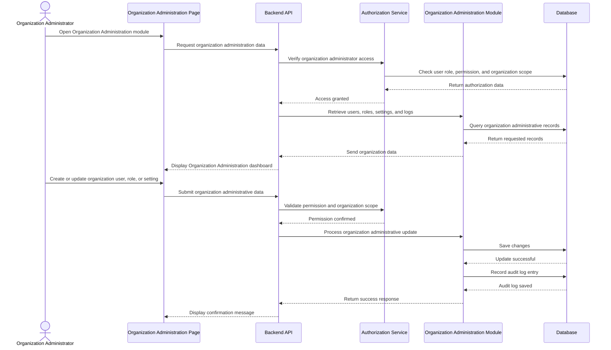

---

### Classes

#### organizationAdminRouter
Defines the API routes for organization administration operations. It maps incoming HTTP requests to the appropriate controller functions.

#### organizationAdminController
Handles organization administration API requests and responses. It receives validated input, calls the service layer, and returns the appropriate response to the client.

#### organizationAdminService
Contains the business logic for organization administration functions. It manages organization users, roles, permissions, settings, and audit log retrieval within the same organization scope.

#### organizationAdminRepository
Handles data access and database queries related to organization administration functions. It is responsible for retrieving and storing organization users, roles, permissions, settings, and audit logs.

#### organizationAdminValidator
Validates request data for organization administration operations. It ensures required account, role, and settings data are complete and correctly formatted before processing.

---

### Error Handling

400
Invalid input data

401
Unauthorized access

403
Insufficient organization administrative privileges

404
User, role, or setting not found

409
Duplicate email or conflicting organization configuration

500
Internal server error

---

## Module 12

Supplier Dashboard

***

### Responsibilities

- Allow authenticated users belonging to invited supplier companies to access the supplier dashboard.   
- Allow invited supplier company users to complete required supplier company registration or onboarding steps after account registration.  
- Allow supplier company users to view RFQs assigned or made available to their company.   
- Allow supplier company users to select an RFQ and review its details before quotation submission.   
- Allow supplier company users to submit quotations for eligible RFQs assigned or made available to their company.   
- Allow supplier company users to view purchase orders issued to their company.  
- Restrict supplier dashboard access and actions to records associated only with the authenticated user and linked supplier company.   

***

### Functional Requirements

- Only authenticated users belonging to a company with a valid supplier invitation or approved supplier relationship shall be allowed to access the supplier dashboard.  
- The system shall allow invited supplier company users to complete supplier company onboarding and required profile registration through the application.  
- Completion of supplier onboarding shall create or link the supplier company record so that it becomes visible in the Supplier Management module of the buyer organization that issued the invitation.  
- The system shall allow supplier company users to view RFQs assigned or made available to their company.   
- The system shall allow supplier company users to retrieve and review RFQ details before quotation submission.   
- The system shall allow supplier company users to submit quotations only for open and valid RFQs within the allowed submission period.   
- The system shall allow supplier company users to view active, ongoing, and completed purchase orders issued to their company.  
- The system shall restrict supplier company users to viewing and managing only their own company profile, quotations, RFQs, and purchase orders within the permitted supplier scope.  
- The system shall block quotation submission when required quotation fields are incomplete or when the RFQ is no longer eligible for response.  
- The system shall record quotation submission details, timestamps, and related supplier company references for traceability.  

***

### Business Rules

- A user may access the Supplier Dashboard only if the user belongs to a company with a valid supplier invitation or approved supplier relationship.  
- A supplier company user may view only RFQs and purchase orders assigned or made available to that supplier company.  
- A supplier company user may submit a quotation only for an open and valid RFQ assigned or made available to its company.   
- The selected RFQ and its details must be displayed before quotation submission.  
- Supplier company onboarding must be completed through the invitation flow before supplier participation is fully activated.  
- Completion of supplier registration shall update the supplier onboarding or relationship status according to the configured onboarding workflow.  
- A quotation submission must include all required fields before it can be submitted.  
- A supplier company user may not submit a quotation after the specified submission deadline.  
- A supplier company user may access and manage only the records associated with its own supplier company.  
- Purchase orders displayed in the Supplier Dashboard shall be read-only unless a separate supplier-side action is explicitly supported by the system.  

***

### API Endpoints

POST  
/api/supplier-dashboard/register-company  
/api/supplier-dashboard/quotations  

GET  
/api/supplier-dashboard/profile  
/api/supplier-dashboard/rfqs  
/api/supplier-dashboard/rfqs/:rfqId  
/api/supplier-dashboard/orders  
/api/supplier-dashboard/orders?status=ongoing  
/api/supplier-dashboard/orders?status=completed  

PUT  
/api/supplier-dashboard/profile  

***

### Validation

- invitationtoken  
- companyname  
- companyaddress  
- companyemail  
- companycontactnumber  
- taxidentificationnumber  
- rfqid  
- suppliercompanyid  
- quoteprice  
- quotedquantity  
- currency  
- deliverydate  
- quotevaliduntil  
- leadtimedays  
- remarks  
- Invitation token must match an existing, valid, and non-expired supplier invitation record.  
- The authenticated user must be linked to a company with a valid supplier invitation or approved supplier relationship before dashboard access is granted.  
- Supplier company registration must contain the required business and contact details before onboarding can be completed.  
- RFQ reference must match an existing and accessible RFQ record assigned or made available to the supplier company.  
- Quotation submission must be blocked if the RFQ is closed, expired, or not assigned to the supplier company.  
- Attachment must be present if supporting documents are required.   
- Submission shall be blocked if required fields are incomplete.  

***

### Database Tables

- **supplier_profiles**  
  - Stores the supplier company’s registered business information, including company name, address, contact details, tax identification number, and registration details.  
  - Linked to the invited supplier company and its authenticated user records.  

- **supplierinvitations**  
  - Stores supplier onboarding invitation records generated by the buyer organization.  
  - Includes invitation token, invitation status, expiration timestamp, and completion timestamp.  

- **supplier_company_relationships**  
  - Stores the relationship between the buyer company and the supplier company.  
  - Used to determine whether the supplier relationship is invited, in progress, approved, active, suspended, or otherwise restricted under a specific buyer organization.  

- **rfq_supplier_assignments**  
  - Stores the RFQs assigned or made available to a specific supplier company.  
  - Used to control which RFQs are visible in the Supplier Dashboard.  

- **quotations**  
  - Stores quotations submitted by the supplier company for selected RFQs.   
  - Includes quotation status, total amount, currency, delivery date, quote validity period, lead time, remarks, submitted by, and submission timestamp.  

- **quotation_items**  
  - Stores the individual line items associated with each quotation.  
  - Includes item description, quoted quantity, unit price, subtotal, and remarks where applicable.  

- **Referenced Existing Tables**  
  - `users` stores authentication and account ownership data for supplier company users.  
  - `companies` stores buyer and supplier organization records.   
  - `rfqs` and `rfq_items` store procurement-side RFQ records and corresponding line items.  
  - `purchaseorders` stores awarded or active supplier orders.  

***

### Sequence Diagram

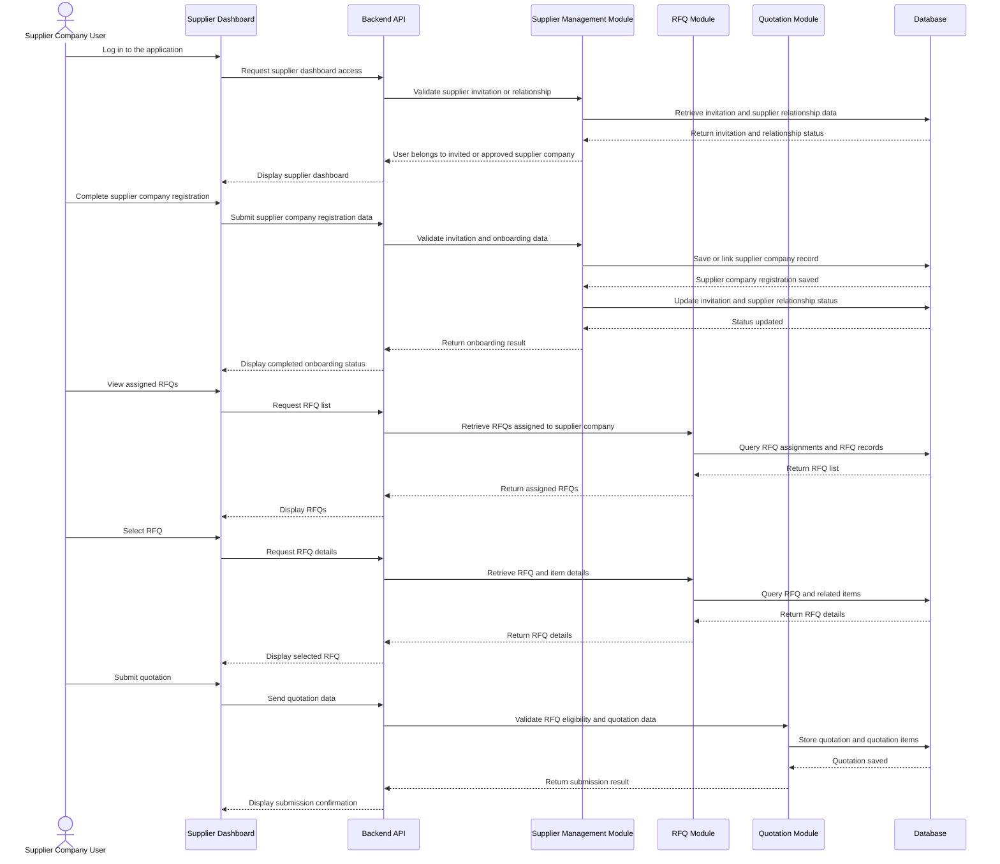

***

### Classes

- supplierDashboardRouter  
- supplierDashboardController  
- supplierDashboardService  
- supplierDashboardRepository  
- supplierDashboardValidator  

***

### Error Handling

400 Invalid supplier dashboard request data    
401 Unauthorized access    
403 Supplier company access is not allowed for the requested record or dashboard action    
404 Supplier invitation, supplier company record, RFQ, quotation, or purchase order not found    
409 Supplier onboarding already completed or quotation already submitted, or the record is in a conflicting state    
410 Supplier invitation link expired    
422 Supplier dashboard validation failed    
500 Internal server error    
503 Supplier dashboard service unavailable  

