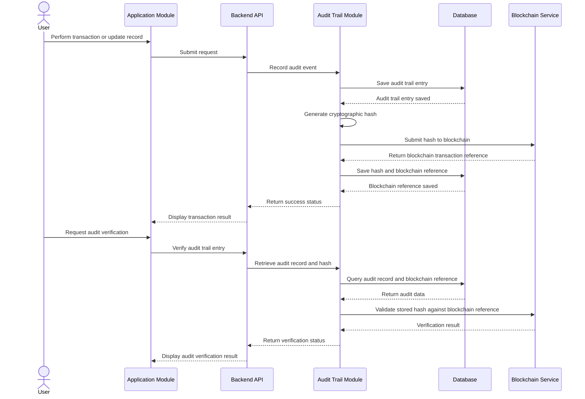
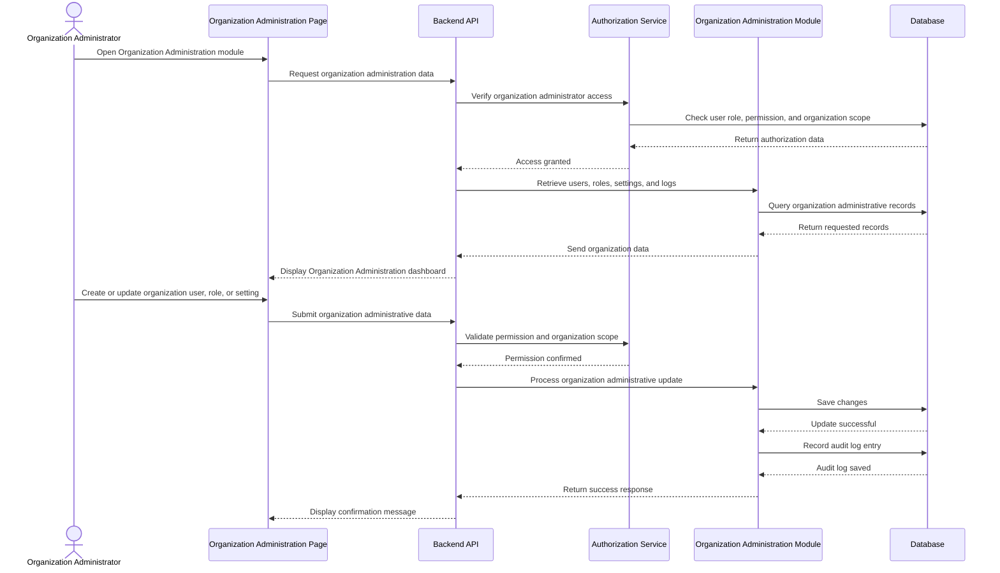
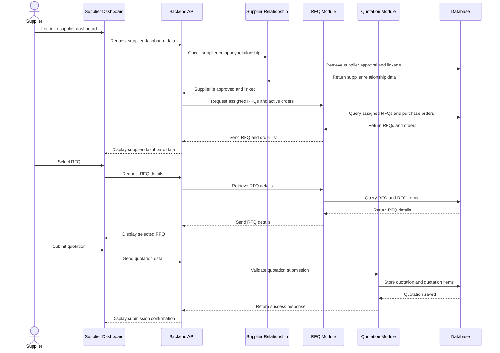

# Low Level Design

# Introduction

## Purpose

This documentation serves as a technical implementation of the 
procurement management system

Low level Design primarily focus on internal design of each of the 
system's module including api's, Database interactions, Business logic, 
Validation rules, workflows and class relationships.

# Module Overview 

Modules Included

- Authentication
- User Management
- Procurement Request
- Approval Workflow
- Supplier Management
- Purchase Order Management
- Delivery Verification
- Invoice Verification
- Reporting
- Organization Administration
- Supplier Dashboard

## Module 1

---

### Responsibilities

---

### Functional Requirements

---

### Business Rules

---

### API Endpoints

---

### Validation

---

### Database Tables

---

### Sequence Diagram 

---

### Classes

---

### Error Handling 

---

## Module 2

User Management

---

### Responsibilities

---

### Functional Requirements

---

### Business Rules

---

### API Endpoints

---

### Validation

---

### Database Tables

---

### Sequence Diagram 

---

### Classes

---

### Error Handling 

---

## Module 3

Procurement Request

---

### Responsibilities

---That works because LLD usually breaks the system into detailed modules, data structures, 

### Functional Requirements

---

### Business Rules

---

### API Endpoints

---

### Validation

---

### Database Tables

---

### Sequence Diagram 

---

### Classes

---

### Error Handling 

---

## Module 4

Approval Workflow

---

### Responsibilities

---

### Functional Requirements

---

### Business Rules

---

### API Endpoints

---

### Validation

---

### Database Tables

---

### Sequence Diagram 

---

### Classes

---

### Error Handling 

---

## Module 5

Supplier Management

---

### Responsibilities

---

### Functional Requirements

---

### Business Rules

---

### API Endpoints

---

### Validation

---

### Database Tables

---

### Sequence Diagram 

---

### Classes

---

### Error Handling 

---

## Module 6

Purchase Order Management

---

### Responsibilities

---

### Functional Requirements

---

### Business Rules

---

### API Endpoints

---

### Validation

---

### Database Tables

---

### Sequence Diagram 

---

### Classes

---

### Error Handling 

---

## Module 7

Delivery Verification

--- 

### Responsibilities

---

### Functional Requirements

---

### Business Rules

---

### API Endpoints

---

### Validation

---

### Database Tables

---

### Sequence Diagram 

---

### Classes

---

### Error Handling 

---

## Module 8

Invoice Verification

---

### Responsibilities

---

### Functional Requirements

---

### Business Rules

---

### API Endpoints

---

### Validation

---

### Database Tables

---

### Sequence Diagram 

---

### Classes

---

### Error Handling 

---

## Module 9

Reporting

---

### Responsibilities

---

### Functional Requirements

---

### Business Rules

---

### API Endpoints

---

### Validation

---

### Database Tables

---

### Sequence Diagram 

---

### Classes

---

### Error Handling 

---

## Module 10

Audit Trail

---

### Responsibilities

- Record significant user and system actions performed within the application.
- Maintain a chronological and tamper-evident history of transactions and record changes.
- Generate cryptographic hashes of audit records for blockchain verification.
- Store blockchain transaction references associated with verified audit trail entries.
- Allow authorized users to view and verify audit records and related blockchain status.

---

### Functional Requirements

- The system shall record important user and system actions as audit trail entries.
- The system shall capture details such as user, action performed, affected module, affected record, timestamp, and related metadata.
- The system shall generate a hash value for each audit trail entry or grouped audit transaction.
- The system shall submit the generated hash to the configured blockchain network for verification.
- The system shall store the resulting blockchain transaction reference together with the related audit trail record.
- The system shall allow authorized users to view audit trail entries and their blockchain verification status.
- The system shall allow authorized users to verify whether an audit trail entry matches its recorded blockchain hash.
- The system shall restrict audit trail access to authorized users only.

---

### Business Rules

- Only significant user and system actions shall be recorded in the audit trail.
- Every audit trail entry must contain the acting user, action type, affected module, timestamp, and affected record reference when applicable.
- An audit trail entry must not be editable or deletable through normal application functions.
- Each audit trail entry or audit batch must generate a unique cryptographic hash before blockchain submission.
- The blockchain transaction hash or reference shall be stored after successful blockchain anchoring.
- Audit trail verification shall compare the current audit record hash with the blockchain-anchored hash.
- Only authorized users may access and review audit trail records.
- Failed blockchain submissions shall not remove the original audit trail record from the application database.
- Audit records shall remain available even if blockchain verification is temporarily unavailable.

---

### API Endpoints

POST
/api/audit-trails/verify/:auditId
/api/audit-trails/blockchain-anchor

GET
/api/audit-trails
/api/audit-trails/:auditId
/api/audit-trails?module=procurement
/api/audit-trails?status=verified
/api/audit-trails?status=pending

---

### Validation

- user_id
- action_type
- module_name
- record_id
- record_type
- action_timestamp
- hash_value
- blockchain_network
- blockchain_tx_hash
- Verification blocked if required audit data is incomplete
- Blockchain anchoring blocked if hash value is missing
- Blockchain transaction reference must be stored only after a successful submission response
- Audit trail entry must contain valid module and action references

---

### Database Tables

- **audit_trails**
  - Stores the main audit trail records for significant user and system actions.
  - Includes user identifier, action type, module name, affected record reference, timestamp, status, and metadata.

- **audit_trail_hashes**
  - Stores the cryptographic hash generated for an audit trail entry or audit batch.
  - Used for integrity checking and blockchain verification.

- **audit_trail_blockchain_refs**
  - Stores blockchain-related references linked to audit trail records.
  - Includes blockchain network name, transaction hash, block number, verification status, and anchoring timestamp.

- **Referenced Existing Tables**
  - `users` — stores the user account associated with the recorded action.
  - `companies` — stores the company or organization related to the action where applicable.
  - `rfqs`, `quotations`, `purchase_orders`, and other transactional tables — store the business records referenced by the audit trail.

---

### Sequence Diagram

---

### Classes

#### auditTrailRouter
Defines the API routes for audit trail operations. It maps incoming HTTP requests to the appropriate controller functions.

#### auditTrailController
Handles audit trail API requests and responses. It receives requests for listing, viewing, anchoring, and verifying audit records, then returns the appropriate response to the client.

#### auditTrailService
Contains the business logic for audit trail operations. It records actions, generates cryptographic hashes, initiates blockchain anchoring, and verifies audit entries against blockchain references.

#### auditTrailRepository
Handles data access and database queries related to audit trail records, generated hashes, and blockchain transaction references.

#### auditTrailValidator
Validates request data for audit trail operations. It ensures required audit fields, hash values, and verification inputs are complete and correctly formatted before processing.

---

### Error Handling

400
Invalid audit request data

401
Unauthorized access

403
Insufficient privileges to access audit trails

404
Audit trail record not found

409
Audit trail already anchored or conflicting blockchain reference

422
Audit verification failed

500
Internal server error

503
Blockchain service unavailable

---

## Module 11

Organization Administration

---

### Responsibilities

- Manage user accounts within the organization.
- Assign organization-level roles and permissions to company users.
- Maintain organization-specific settings and administrative controls.
- Monitor organization-level administrative actions through audit logs.
- Restrict administrative functions to authorized users within the organization only.

---

### Functional Requirements

- The organization administrator shall be able to create, update, deactivate, and view user accounts within the organization.
- The organization administrator shall be able to assign and modify roles and permissions for users within the organization.
- The organization administrator shall be able to configure organization-specific settings required for company operations.
- The organization administrator shall be able to view audit logs of important administrative activities within the organization.
- The system shall restrict organization administration pages and functions to authorized users within the same organization only.
- The system shall record significant administrative changes such as user updates, role assignments, and organization setting changes.

---

### Business Rules

- Only authorized organization administrators may access the Organization Administration module.
- An organization administrator may create, modify, or deactivate only the user accounts belonging to the same organization.
- A user account must be assigned an appropriate organization role before the account can access protected organization functions.
- Administrative changes to user access, roles, and organization settings must be recorded in the audit log.
- An organization administrator shall not access or modify users, settings, or records belonging to another organization.
- Deactivated users shall not be allowed to log in or access protected organization features.
- Organization settings shall not be changed without appropriate organization-level permission.

---

### API Endpoints

POST
/api/org-admin/users
/api/org-admin/roles
/api/org-admin/settings

GET
/api/org-admin/users
/api/org-admin/users/:userId
/api/org-admin/roles
/api/org-admin/settings
/api/org-admin/audit-logs

PUT
/api/org-admin/users/:userId
/api/org-admin/roles/:roleId
/api/org-admin/settings/:settingId

PATCH
/api/org-admin/users/:userId/status

---

### Validation

- first_name
- last_name
- email
- password
- role_id
- account_status
- setting_key
- setting_value
- organization_id
- Audit log entry required for administrative updates when applicable
- Submission blocked if required administrative fields are incomplete
- Email must be in valid format
- Password must satisfy system security requirements
- Role assignment must reference an existing valid role within the organization

---

### Database Tables

- **organization_users**
  - Stores the relationship between users and the organization.
  - Used to determine which users belong to a specific organization.

- **organization_roles**
  - Stores organization-level roles such as company owner, chief procurement officer, procurement officer, and company administrator.
  - Used to define access levels within a specific organization.

- **organization_permissions**
  - Stores the available permissions for organization users and modules.
  - Used to define allowed actions within the organization scope.

- **organization_role_permissions**
  - Stores the mapping between organization roles and permissions.
  - Used to determine what actions are allowed for each assigned organization role.

- **organization_settings**
  - Stores configurable settings for a specific organization.
  - Used to maintain organization-level operational configurations.

- **audit_logs**
  - Stores records of important user and administrative actions within the organization.
  - Includes user identifier, organization identifier, action performed, affected record, timestamp, and related details.

- **Referenced Existing Tables**
  - `users` — stores authentication and account ownership data.
  - `companies` — stores organization records.

---

### Sequence Diagram

---

### Classes

#### organizationAdminRouter
Defines the API routes for organization administration operations. It maps incoming HTTP requests to the appropriate controller functions.

#### organizationAdminController
Handles organization administration API requests and responses. It receives validated input, calls the service layer, and returns the appropriate response to the client.

#### organizationAdminService
Contains the business logic for organization administration functions. It manages organization users, roles, permissions, settings, and audit log retrieval within the same organization scope.

#### organizationAdminRepository
Handles data access and database queries related to organization administration functions. It is responsible for retrieving and storing organization users, roles, permissions, settings, and audit logs.

#### organizationAdminValidator
Validates request data for organization administration operations. It ensures required account, role, and settings data are complete and correctly formatted before processing.

---

### Error Handling

400
Invalid input data

401
Unauthorized access

403
Insufficient organization administrative privileges

404
User, role, or setting not found

409
Duplicate email or conflicting organization configuration

500
Internal server error

---

## Module 12

Supplier Dashboard

---
 
### Responsibilities

- The supplier shall be able to view RFQs assigned or made available to its company.
- The supplier shall be able to select an RFQ and review its details.
- The supplier shall be able to submit a quotation for an assigned RFQ.
- The supplier shall be able to view active or ongoing purchase orders issued to its company.
- The supplier shall be able to maintain and update required company profile details.
- The system shall restrict supplier access to records associated only with the authenticated supplier account and linked company.

---

### Functional Requirements

- The supplier shall be able to view RFQs assigned or made available to its company.
- The supplier shall be able to select an RFQ and review its details.
- The supplier shall be able to submit a quotation for a selected RFQ.
- The supplier shall be able to view active or ongoing purchase orders issued to its company.
- The supplier shall be able to view completed purchase orders previously issued to its company.
- The supplier shall be able to maintain and update required company profile details.
---

### Business Rules

- A supplier may view only purchase orders or requests for quotation assigned or made available to that supplier.
- A supplier may submit a quotation only for an open and valid purchase order or request for quotation.
- The system must display the selected RFQ and its details before quotation submission.
- A supplier must complete the required company details during registration or profile setup.
- Only registered and approved vendors may access the supplier dashboard.
- A quotation submission must include all required fields before it can be submitted.
- A supplier may not submit a quotation after the specified submission deadline.
- A supplier may access and manage only its own company profile, quotations, and procurement records.

---

### API Endpoints

POST
/api/vendors/quotations

GET
/api/vendors/rfqs
/api/vendors/rfqs/:rfqId
/api/vendors/orders
/api/vendors/orders?status=ongoing
/api/vendors/orders?status=completed

### Validation

- quote_price
- quoted_quantity
- currency
- delivery_date
- quote_valid_until
- lead_time_days
- remarks
- Attachment is required if supporting documents are mandatory.
- Submission shall be blocked if required fields are incomplete.

---

### Database Tables

- **supplier_profiles**
  - Contains the supplier company’s registered business information, including company name, address, contact details, tax identification number, and registration details.
  - Linked to the authenticated supplier user account.

- **supplier_company_relationships**
  - Contains the relationship between the buyer company and the supplier company.
  - Used to determine whether the supplier is pending, approved, or active under a specific buyer organization.

- **rfq_supplier_assignments**
  - Contains the RFQs assigned or made available to a specific supplier.
  - Used to control which RFQs are visible in the supplier dashboard.

- **quotations**
  - Contains the quotation submitted by the supplier for a selected RFQ.
  - Includes quotation status, total amount, currency, delivery date, quote validity period, lead time, and remarks.

- **quotation_items**
  - Contains the individual line items associated with a quotation.
  - Includes item description, quoted quantity, unit price, and subtotal.

- **Referenced Existing Tables**
  - `users` — stores authentication and account ownership data.
  - `companies` — stores buyer and supplier organization records.
  - `rfqs` and `rfq_items` — store procurement-side RFQ records and their corresponding line items.
  - `purchase_orders` — stores awarded or active supplier orders.

---

### Sequence Diagram

--- 

### Classes

- supplierRouter
- supplierController
- supplierService
- supplierRepository
- supplierValidator

---

### Error Handling 

404
RFQ not found

500
Internal server Error

---
